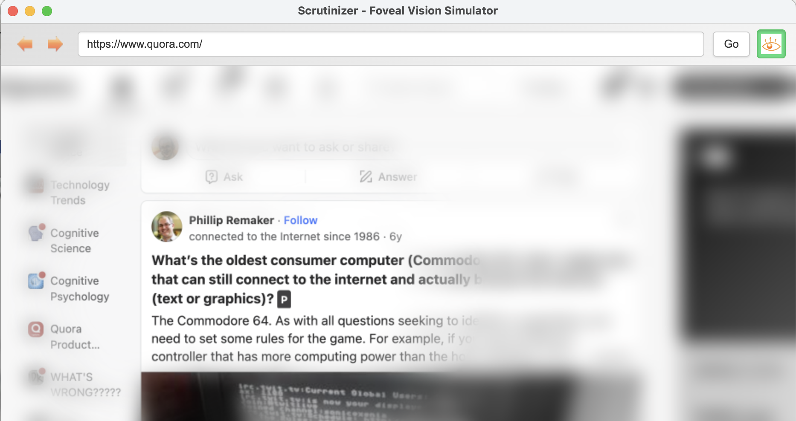

# Scrutinizer - Foveal Vision Simulator

A modern recreation of the 2007 Scrutinizer vision-simulating browser, built with Electron and Canvas API.

**Original project:** https://github.com/andyed/scrutinizer  


## What is Scrutinizer?

Scrutinizer simulates **foveal vision** - how your eyes actually see the world:
- **Fovea (center)**: Sharp, full-color vision in a small area (~2° of visual field)
- **Periphery**: Blurred and desaturated everywhere else

This simulates what your brain is actually seeing at any moment in time -- high res and color for a small angle of vision, and lower resolution with less color in the wider angles.

### What's it for?
- In general, raising consciousness on the importance of visual design
- Studying how your page design enables visual search
- Observing users while using the browser to better enable you to understand their thought process

## Features

### Demo Video

[](https://www.youtube.com/watch?v=lfROtjCp7bg)

- 🎯 **Foveal mask** that follows your mouse cursor
- 🌫️ **Peripheral blur** using box blur algorithm
- 🎨 **Desaturation** using ColorMatrix luminance weights from the original implementation
- 📜 **Scroll detection** with automatic recapture
- 🔄 **DOM mutation detection** for dynamic content
- ⌨️ **Keyboard shortcuts** (Space to toggle, wheel to adjust size)
- 🎚️ **Adjustable foveal radius** (20-300px)

## Installation

```bash
# Install dependencies
npm install

# Run the application
npm start
```

## Usage

1. **Navigate**: Enter a URL in the address bar and click "Go"
2. **Enable**: Click "Enable Foveal Mode" or press `Space`
3. **Adjust**: Use the slider or mouse wheel to change foveal size
4. **Explore**: Move your mouse to see the foveal effect in action

### Keyboard Shortcuts

- `Space` - Toggle foveal mode on/off
- `Escape` - Disable foveal mode
- `Mouse Wheel` - Adjust foveal radius (when enabled)

## Technical Details

### How does it work?

The software captures a bitmap of the page, blurs and desaturates it. The overlay is placed on top of the web page with a foveal sized mask enabling see through wherever the mouse is located.

### Electron Architecture

This implementation leverages Electron's unique capabilities to interact with browser content:

#### Webview Tag
We use Electron's [`<webview>` tag](https://www.electronjs.org/docs/latest/api/webview-tag) to embed a fully-functional browser within the application. The webview is an isolated browser context that can load any web page while remaining sandboxed from the parent application.

#### IPC Communication
To track mouse movements and page events within the webview, we use Electron's **Inter-Process Communication (IPC)**:

1. **Injecting Code**: Using `webview.executeJavaScript()`, we inject tracking code into the loaded page
2. **Sending Events**: The injected code uses `ipcRenderer.sendToHost()` to send mouse coordinates, scroll events, and DOM mutations back to the parent
3. **Receiving Events**: The parent listens via `webview.addEventListener('ipc-message')` to receive these events

```javascript
// In parent (renderer process)
webview.addEventListener('ipc-message', (event) => {
  if (event.channel === 'mousemove') {
    updateFovealMask(event.args[0], event.args[1]);
  }
});

// Injected into webview
const { ipcRenderer } = require('electron');
window.addEventListener('mousemove', (e) => {
  ipcRenderer.sendToHost('mousemove', e.clientX, e.clientY);
});
```

#### Canvas Overlay
A Canvas element positioned absolutely over the webview captures the page content (via html2canvas), applies image processing, and renders the foveal effect. The canvas has `pointer-events: none` so mouse events pass through to the webview below.

This architecture allows us to:
- ✅ Load any web page in the embedded browser
- ✅ Track user interactions (mouse, scroll, mutations) in real-time
- ✅ Capture and process the visual content
- ✅ Overlay the processed image while maintaining interactivity

### Architecture

- **Electron**: Cross-platform desktop app framework
- **Webview**: Embedded browser for rendering web content
- **Canvas API**: Image processing and overlay rendering
- **html2canvas**: DOM-to-canvas capture library

### Image Processing Pipeline

```
DOM → html2canvas → Desaturate → Box Blur → Foveal Mask → Render
```

### ColorMatrix Implementation

The desaturation algorithm uses the same luminance weights as the original ActionScript ColorMatrix:

```javascript
const LUM_R = 0.212671;
const LUM_G = 0.715160;
const LUM_B = 0.072169;

gray = r * LUM_R + g * LUM_G + b * LUM_B;
```

### Performance Optimizations

- Debounced scroll/mutation events (150-200ms)
- `requestAnimationFrame` for smooth rendering
- Smooth mouse interpolation for natural movement
- Efficient box blur implementation

## Project Structure

```
scrut25/
├── main.js                 # Electron main process
├── package.json           # Dependencies and scripts
└── renderer/
    ├── index.html         # Main UI
    ├── app.js            # Application initialization
    ├── scrutinizer.js    # Core foveal vision logic
    ├── image-processor.js # Desaturation and blur algorithms
    ├── config.js         # Configuration constants
    └── styles.css        # UI styling
```

## Configuration

Edit `renderer/config.js` to customize:

- `fovealRadius`: Size of the clear vision area (default: 100px)
- `blurRadius`: Amount of peripheral blur (default: 15px)
- `desaturationAmount`: Grayscale intensity (default: 1.0)
- `maskSmoothness`: Mouse tracking responsiveness (default: 0.5)
- `scrollDebounce`: Scroll event delay (default: 150ms)
- `mutationDebounce`: DOM change delay (default: 200ms)

## Related Works

- **Commercial Service**: http://www.attensee.com
- **Academic Work**:
  - Alex Faaborg's MS Work: http://alumni.media.mit.edu/~faaborg/research/cornell/cg_fovealvision_site/index.htm (2001)
  - D. Lagun, E. Agichtein, "ViewSer: A Tool for Large-Scale Studies of Web Search Result Examination", CHI 2011
  - The Flashlight Project @ http://vlab.ethz.ch/flashlight/index.php

## Contributors

### Original Scrutinizer (2007)
- **Creator**: Andy Edmonds
- **Coders**: James Douma @ Nitobi, Inc., Andy Edmonds, Evan Mullins
- **Designers**: Evan Mullins, Dave Hallock
- **Libraries**: ColorMatrix derived from work by Mario Klingeman

### This Recreation (2025)
- Modern Electron/Canvas API implementation
- Preserves original ColorMatrix algorithm

## License

Copyright (c) 2012, Andy Edmonds  
All rights reserved.

Excepting ColorMatrix library licensed under Apache 2.0

Redistribution and use in source and binary forms, with or without modification, are permitted provided that the following conditions are met:

- Redistributions of source code must retain the above copyright notice, this list of conditions and the following disclaimer.
- Redistributions in binary form must reproduce the above copyright notice, this list of conditions and the following disclaimer in the documentation and/or other materials provided with the distribution.

THIS SOFTWARE IS PROVIDED BY THE COPYRIGHT HOLDERS AND CONTRIBUTORS "AS IS" AND ANY EXPRESS OR IMPLIED WARRANTIES, INCLUDING, BUT NOT LIMITED TO, THE IMPLIED WARRANTIES OF MERCHANTABILITY AND FITNESS FOR A PARTICULAR PURPOSE ARE DISCLAIMED. IN NO EVENT SHALL THE COPYRIGHT HOLDER OR CONTRIBUTORS BE LIABLE FOR ANY DIRECT, INDIRECT, INCIDENTAL, SPECIAL, EXEMPLARY, OR CONSEQUENTIAL DAMAGES (INCLUDING, BUT NOT LIMITED TO, PROCUREMENT OF SUBSTITUTE GOODS OR SERVICES; LOSS OF USE, DATA, OR PROFITS; OR BUSINESS INTERRUPTION) HOWEVER CAUSED AND ON ANY THEORY OF LIABILITY, WHETHER IN CONTRACT, STRICT LIABILITY, OR TORT (INCLUDING NEGLIGENCE OR OTHERWISE) ARISING IN ANY WAY OUT OF THE USE OF THIS SOFTWARE, EVEN IF ADVISED OF THE POSSIBILITY OF SUCH DAMAGE.

