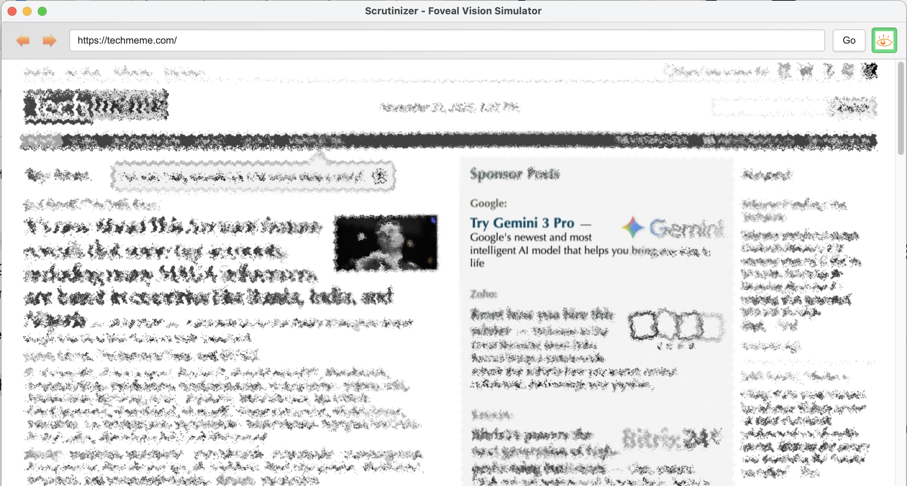

# Scrutinizer - Foveal Vision Simulator

A modern recreation of the 2007 Scrutinizer vision-simulating browser, built with Electron and the Canvas API, and positioned as a **design constraint model** for studying foveal vs. peripheral vision on the web.

**Original project:** https://github.com/andyed/scrutinizer  


## What is Scrutinizer?

Scrutinizer simulates **foveal vision** - how your eyes actually see the world:
- **Fovea (center)**: Sharp, full-color vision in a small area (~2° of visual field)
- **Periphery**: Blurred and desaturated everywhere else

This approximates what reaches the eye at any moment in time: high resolution and color for a small angle of vision, and lower resolution with less color in the wider angles.

### Vision as Controlled Hallucination

While the perceptual experience of vision feels stable and continuous, the underlying physiology is highly inhomogeneous. **Vision is not a camera feed; it is a controlled hallucination** (Anil Seth). Your brain:
- Is effectively **blind for ~40 minutes per day** during saccades (eye movements)
- Uses **predictive modeling** to "edit out" the blackouts and motion blur
- Stitches together a seamless timeline of reality that exists only in your **mind's eye**
- Processes peripheral vision as **summary statistics** ("Mongrel Theory" - Ruth Rosenholtz, MIT), not just blurred detail

Scrutinizer approximates the **retinal input constraint** (what reaches the eye), not the full cognitive integration the brain performs across eye movements. It is best understood as a **simulation of visual constraint**, not a literal recreation of subjective experience.

### What's it for?
- Using foveal/peripheral constraints as a **design stress test** for layouts and iconography
- Evaluating how well a page **supports visual search and peripheral guidance** (can users find what matters when detail is limited?)
- Testing **"information scent"** (Information Foraging Theory) - whether peripheral cues trigger foveal attention
- Understanding **banner blindness** as a feature, not a bug (peripheral vision successfully filtering low-value content)
- Providing observers and designers with a **qualitative window into constrained perception**, complementary to eye-tracking metrics rather than a replacement for them
- Revealing the **"heatmap lie"** - users often click buttons they never foveally fixated on, guided by peripheral summary statistics alone

### The Pitch
Vision is not a camera feed. It is a controlled hallucination.

We assume we see the world in high-definition 180° video. We don't. The human eye is a biological scanner with a terrifyingly narrow bandwidth.

The Reality You only possess "20/20 vision" in the Fovea—a tiny patch of retina roughly the size of your thumb held at arm's length. Everything else is the Periphery: a low-resolution, color-blind, motion-sensitive sensor that doesn't "see" objects, but merely guesses at their textures.

Your brain stitches these jittery, low-fidelity snapshots into a seamless timeline, editing out the blurs and blackouts in real-time. You are effectively blind to detail for 98% of your visual field.

What Scrutinizer Does Scrutinizer strips away the brain's post-processing to reveal the raw data your optic nerve actually receives.

Foveal Simulation: A precise window of high-acuity focus that follows your cursor.

Peripheral Mongrels: Uses "texture synthesis" algorithms to simulate Visual Crowding—where text and shapes disintegrate into statistical noise outside the center.

Rod-Weighted Luminance: Simulates the spectral sensitivity of peripheral rod cells, revealing why "Aqua" buttons glow while red text vanishes.

Why Use It? Designers & Engineers: Stop designing for the "Screenshot." Start designing for the Scan. If your interface doesn't work in Scrutinizer, your users aren't seeing it—they are just hallucinating that they did.

## Features

### Demo Video

[](https://www.youtube.com/watch?v=lfROtjCp7bg)

- 🎯 **Binocular foveal mask** that follows your mouse cursor with distinctive 16:9 shape
- 🧠 **Neural processing model** using Box Sampling with Noise (not optical blur)
  - **Parafoveal jitter**: High-contrast but spatially uncertain (simulates crowding/feature migration)
  - **Peripheral block sampling**: Pixelated/mosaic effect (simulates sparse photoreceptor density)
- 🎨 **Progressive desaturation** with real-time radial gradient (color → grayscale) that follows cursor at 60fps
- 🧬 **ColorMatrix luminance weights** preserved from the original implementation for accurate grayscale conversion
- 📜 **Scroll detection** with automatic recapture
- 🔄 **DOM mutation detection** for dynamic content
- ⌨️ **Keyboard shortcuts** (Alt+Space to toggle, Alt+wheel to adjust size)
- 🎚️ **Menu-based controls** for radius and blur presets
- ⚡ **Web Worker** for non-blocking blur computation

## Installation

```bash
# Install dependencies
npm install

# Run the application
npm start
```

## Usage

1. **Navigate**: Enter a URL in the address bar and click **Go**
2. **Enable**: Click the eye icon or press `Space` to toggle foveal mode
3. **Adjust**:
   - Use the **View → Foveal Radius** menu to pick a radius preset
   - Use **View → Blur Amount** to adjust peripheral blur
   - Or hold `Alt` and use the **mouse wheel** while foveal mode is enabled
4. **Observe**: Watch how easily key elements can be located using mostly peripheral vision

### Keyboard Shortcuts

- `Space` - Toggle foveal mode on/off
- `Escape` - Disable foveal mode
- `Mouse Wheel` (with `Alt`) - Adjust foveal radius (when enabled)

## Limitations

Scrutinizer is intentionally **approximate**:

- It models **retinal input constraints** (spatial uncertainty/downsampling outside foveal region), not the brain's transsaccadic integration that stabilizes perception.
- **Current implementation** uses Box Sampling with Noise to simulate neural processing:
  - ✅ **Parafoveal jitter** simulates crowding (feature migration)
  - ✅ **Block sampling** simulates sparse photoreceptor density
  - ⚠️ Does not implement full "Mongrel Theory" (summary statistics with texture synthesis)
- It assumes a fixed relationship between screen pixels and **visual angle**; without calibration for viewing distance and display size, the simulated fovea may be larger or smaller than a physiological 1–2°.
- **Saccadic suppression** (blindness during eye movements) is not simulated.
- **Chromatic aberration** (R/B channel splitting) not yet implemented.
- Inter-individual biometric differences (eye geometry, etc.) are not modeled.

As a result, Scrutinizer should be used as a **design constraint model and empathy tool**, not as a precise physiological instrument. It is ideal for stress-testing layouts and peripheral guidance, and should be complemented with real user studies when high-fidelity validation is needed.

**Future development** (see ROADMAP.md): Full Mongrel Theory implementation with chromatic aberration, contrast boost, and WebGL-based domain warping (scrutinizer2025gl).

## Technical Details

### How does it work?

The software captures a bitmap of the page, blurs and desaturates it. The overlay is placed on top of the web page with a foveal sized mask enabling see through wherever the mouse is located.

### Electron Architecture

This implementation leverages Electron's unique capabilities to interact with browser content:

#### Webview Tag
We use Electron's [`<webview>` tag](https://www.electronjs.org/docs/latest/api/webview-tag) to embed a fully-functional browser within the application. The webview is an isolated browser context that can load any web page while remaining sandboxed from the parent application.

#### IPC Communication
To track mouse movements and page events within the webview, we use Electron's **Inter-Process Communication (IPC)**:

1. **Injecting Code**: Using `webview.executeJavaScript()`, we inject tracking code into the loaded page
2. **Sending Events**: The injected code uses `ipcRenderer.sendToHost()` to send mouse coordinates, scroll events, and DOM mutations back to the parent
3. **Receiving Events**: The parent listens via `webview.addEventListener('ipc-message')` to receive these events

```javascript
// In parent (renderer process)
webview.addEventListener('ipc-message', (event) => {
  if (event.channel === 'mousemove') {
    updateFovealMask(event.args[0], event.args[1]);
  }
});

// Injected into webview
const { ipcRenderer } = require('electron');
window.addEventListener('mousemove', (e) => {
  ipcRenderer.sendToHost('mousemove', e.clientX, e.clientY);
});
```

#### Canvas Overlay
A Canvas element positioned absolutely over the webview captures the page content (via html2canvas), applies image processing, and renders the foveal effect. The canvas has `pointer-events: none` so mouse events pass through to the webview below.

This architecture allows us to:
- ✅ Load any web page in the embedded browser
- ✅ Track user interactions (mouse, scroll, mutations) in real-time
- ✅ Capture and process the visual content
- ✅ Overlay the processed image while maintaining interactivity

### Architecture

- **Electron**: Cross-platform desktop app framework
- **Webview**: Embedded browser for rendering web content
- **Canvas API**: Image processing and overlay rendering
- **html2canvas**: DOM-to-canvas capture library

### Image Processing Pipeline

```
DOM → html2canvas → Desaturate → Neural Processing → Foveal Mask → Render
                                  ├─ Parafoveal: Jitter (crowding)
                                  ├─ Near Periphery: 3x3 block sampling
                                  └─ Far Periphery: 5x5 block sampling
```

### ColorMatrix Implementation

The desaturation algorithm uses the same luminance weights as the original ActionScript ColorMatrix:

```javascript
const LUM_R = 0.212671;
const LUM_G = 0.715160;
const LUM_B = 0.072169;

gray = r * LUM_R + g * LUM_G + b * LUM_B;
```

### Performance Optimizations

- Debounced scroll/mutation events (150-200ms)
- `requestAnimationFrame` for smooth rendering
- Smooth mouse interpolation for natural movement
- Efficient box blur implementation

## Project Structure

```
scrut25/
├── main.js                 # Electron main process
├── package.json           # Dependencies and scripts
└── renderer/
    ├── index.html         # Main UI
    ├── app.js            # Application initialization
    ├── scrutinizer.js    # Core foveal vision logic
    ├── image-processor.js # Desaturation and blur algorithms
    ├── config.js         # Configuration constants
    └── styles.css        # UI styling
```

## Configuration

Edit `renderer/config.js` to customize:

- `fovealRadius`: Size of the clear vision area (default: 100px)
- `blurRadius`: Amount of peripheral blur (default: 15px)
- `desaturationAmount`: Grayscale intensity (default: 1.0)
- `maskSmoothness`: Mouse tracking responsiveness (default: 0.5)
- `scrollDebounce`: Scroll event delay (default: 150ms)
- `mutationDebounce`: DOM change delay (default: 200ms)

## Related Work & Theoretical Foundation

### Vision Science & Cognitive Psychology
- **Ruth Rosenholtz (MIT)**: Mongrel Theory and peripheral summary statistics - peripheral vision as lossy compression
- **Anil Seth**: "Controlled hallucination" model of perception and predictive coding
- **Peter Pirolli (Xerox PARC)**: Information Foraging Theory - "information scent" and peripheral cue detection
- **Cohen et al. (2020, PNAS)**: "Refrigerator Light" illusion - 1/3 of observers don't notice peripheral desaturation
- **Balas & Sinha (2007)**: Pan-Field Color Illusion - brain extrapolates foveal color across periphery
- **Maljkovic & Nakayama (1994)**: Priming and rapid visual learning - word form priming accelerates peripheral recognition

### UX & Design Practice
- **Jeff Johnson**: *Designing with the Mind in Mind* - "The periphery is for 'Where?' The fovea is for 'What?'"
- **Susan Weinschenk**: *100 Things Every Designer Needs to Know About People* - peripheral vision as "governor" of foveal attention
- **Nielsen Norman Group**: Eye-tracking research revealing the "heatmap lie" - fixation ≠ perception
- **Luke Wroblewski**: Skeleton screens exploiting chronostasis (saccadic suppression) for perceived performance

### Vision Simulation Tools
- **Commercial service**  
  - Attensee: http://www.attensee.com

- **Academic and research tools**  
  - Alex Faaborg, *Icon Analysis* (Cornell MS): http://alumni.media.mit.edu/~faaborg/research/cornell/cg_fovealvision_site/index.htm (2001)  
  - D. Lagun, E. Agichtein, *ViewSer: A tool for large-scale remote studies of web search result examination*, CHI 2011  
  - Flashlight Project (ETH Zürich): http://vlab.ethz.ch/flashlight/index.php  

Scrutinizer2025 follows this lineage but focuses on **pixel-level, gaze-contingent masking** as an approximation of retinal constraints for design evaluation.

**For detailed theoretical discussion**, see `docs/beta_gemini3_discussion.md` covering:
- Saccadic suppression and chronostasis
- Mongrel Theory and summary statistics
- Information scent and peripheral "Chief of Staff" model
- Word form priming in visual search
- Canvas-based implementation strategies for neural processing simulation

## Contributors

### Original Scrutinizer (2007)
- **Creator**: Andy Edmonds
- **Coders**: James Douma @ Nitobi, Inc., Andy Edmonds, Evan Mullins
- **Designers**: Evan Mullins, Dave Hallock
- **Libraries**: ColorMatrix derived from work by Mario Klingeman

### This Recreation (2025)
- Modern Electron/Canvas API implementation with enhanced physiological accuracy
- **Neural processing model** (Box Sampling with Noise) replaces optical blur:
  - Parafoveal jitter simulates crowding/feature migration
  - Block sampling simulates sparse photoreceptor density
  - Models "bad neural wiring" not "bad optics"
- Real-time progressive desaturation gradient (color → grayscale falloff with eccentricity)
- Web Worker offloads processing for responsive UI
- Preserves original ColorMatrix algorithm and binocular foveal signature
- Progressive spatial uncertainty better models hyperbolic acuity decay
- Smooth 60fps tracking with GPU-accelerated Canvas compositing

## License

Copyright (c) 2012, Andy Edmonds  
All rights reserved.

Excepting ColorMatrix library licensed under Apache 2.0

Redistribution and use in source and binary forms, with or without modification, are permitted provided that the following conditions are met:

- Redistributions of source code must retain the above copyright notice, this list of conditions and the following disclaimer.
- Redistributions in binary form must reproduce the above copyright notice, this list of conditions and the following disclaimer in the documentation and/or other materials provided with the distribution.

THIS SOFTWARE IS PROVIDED BY THE COPYRIGHT HOLDERS AND CONTRIBUTORS "AS IS" AND ANY EXPRESS OR IMPLIED WARRANTIES, INCLUDING, BUT NOT LIMITED TO, THE IMPLIED WARRANTIES OF MERCHANTABILITY AND FITNESS FOR A PARTICULAR PURPOSE ARE DISCLAIMED. IN NO EVENT SHALL THE COPYRIGHT HOLDER OR CONTRIBUTORS BE LIABLE FOR ANY DIRECT, INDIRECT, INCIDENTAL, SPECIAL, EXEMPLARY, OR CONSEQUENTIAL DAMAGES (INCLUDING, BUT NOT LIMITED TO, PROCUREMENT OF SUBSTITUTE GOODS OR SERVICES; LOSS OF USE, DATA, OR PROFITS; OR BUSINESS INTERRUPTION) HOWEVER CAUSED AND ON ANY THEORY OF LIABILITY, WHETHER IN CONTRACT, STRICT LIABILITY, OR TORT (INCLUDING NEGLIGENCE OR OTHERWISE) ARISING IN ANY WAY OUT OF THE USE OF THIS SOFTWARE, EVEN IF ADVISED OF THE POSSIBILITY OF SUCH DAMAGE.

