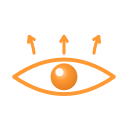
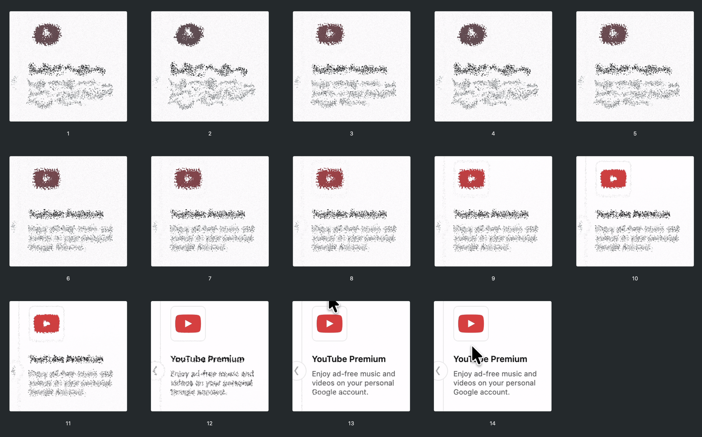

#  Scrutinizer - Foveal Vision Simulator

[](https://www.electronjs.org/)
[](https://developer.mozilla.org/en-US/docs/Web/API/WebGL_API)
[](LICENSE)

➡️ Live site: **[scrutinizer.app](https://andyed.github.io/scrutinizer-www/)**

🍎 macOS Installer: **[Download v1.3.0](https://github.com/andyed/scrutinizer2025/releases/download/v1.3.0/Scrutinizer-1.3.0-arm64.dmg)**

**A design constraint model for studying foveal vs. peripheral vision on the web.**

Scrutinizer is a browser-based simulation that strips away the brain's post-processing to reveal the raw, noisy data your optic nerve actually receives. It compels designers to stop designing for the "Screenshot" and start designing for the "Scan".

It's intended to be useful in the design process, from solo iteration to design review dialogue, and even client presentation (with special modes for storytelling!).

Additionally, there's a long history (keyword: "restricted focus viewer")of using foveal simulation bound to the mouse as a way to conduct user testing, allowing the observer to track the attention of the participant. 

---

## Table of Contents
- [The Concept: Vision as Controlled Hallucination](#the-concept-vision-as-controlled-hallucination)
- [Visualizing the Glance](#visualizing-the-glance)
- [Features](#features)
- [Installation](#installation)
    - [Unsigned Binaries](#unsigned-binaries-experimental-builds)
    - [Developer Setup](#developer-setup-run-from-source)
- [Usage & Controls](#usage--controls)
- [Under the Hood: WebGL Implementation](#under-the-hood-webgl-implementation)
- [Theoretical Foundation](#theoretical-foundation)
- [Limitations](#limitations)
- [License](#license)

---

## The Concept: Vision as Controlled Hallucination

We assume we see the world in high-definition 180° video. We don't. The human eye is a biological scanner with a terrifyingly narrow bandwidth.

* **The Fovea ("The What"):** You only possess "20/20 vision" in a tiny patch of retina roughly the size of your thumb held at arm's length (~2° of visual field).
* **The Periphery ("The Where"):** Everything else is a low-resolution, color-blind, motion-sensitive sensor that doesn't "see" objects, but merely guesses at their textures.

Your brain stitches these jittery, low-fidelity snapshots into a seamless timeline. Scrutinizer disables this "auto-correct" feature, forcing you to navigate using only the raw retinal input.

---

## Visualizing the Glance

This simulation visualizes the split-second mechanics of a glance—how your brain transforms a blurry peripheral cue into a sharp, focused image.



1.  **Frames 1-5 (Far Periphery): The "Mongrel" Zone.** High-frequency details are compressed into statistical noise. Color simulates rod-dominant vision (desaturated), preserving only high-contrast "blobs".
2.  **Frames 6-10 (Parafovea): The "Crowding" Zone.** Color sensitivity returns as cone density increases. Text features emerge, but "Interactional Crowding" prevents legibility.
3.  **Frames 11-14 (Fovea): The "High-Res" Zone.** The central 2° of vision resolves the image, finally allowing the brain to parse semantic meaning.

---

## Features

* **Foveal/Peripheral Vision Simulation**: Toggle between clear central vision and degraded peripheral zones
* **Content Analysis**:
  - **Structure Map**: Analyzes page layout (text rhythm, density, semantic type)
  - **Saliency Map**: Detects visual attention (edges, contrast, high-importance areas)
  - **Fidelity Bias**: Reduces peripheral degradation near salient targets
* **Aesthetic Modes**: High-Key Ghosting, Lab Mode, Frosted Glass, Blueprint, Cyberpunk (with saliency-driven pixelation)
* **Visual Memory**: Simulates iconic memory decay (Off, Limited, Extended, Infinite)
* **Chromatic Aberration**: Lens-like color fringing in periphery
* **Adjustable Parameters**: Foveal radius (20-450px), shape (4 ratios), intensity (0-100%)
* **Neural Processing Model (WebGL)**: Biologically accurate retinal simulation with domain warping

---

## Installation

### 📥 Download (v1.3.0)

> **Note:** Scrutinizer for macOS is now **Signed & Notarized**! No more security warnings.

*   🍎 **macOS (Apple Silicon):** [**Download Scrutinizer-1.3.0.dmg**](https://github.com/andyed/scrutinizer2025/releases/download/v1.3.0/Scrutinizer-1.3.0-arm64.dmg)
*   🪟 **Windows:** Manual build required (Coming soon though, see [Releases Page](https://github.com/andyed/scrutinizer2025/releases))

[**View All Releases & Changelogs**](https://github.com/andyed/scrutinizer2025/releases)

<details>
<summary><strong>Troubleshooting macOS Warnings (Manual/Unsigned Builds Only)</strong></summary>

> **Note:** The official release v1.3.0+ is signed and notarized. You should not see these warnings unless you are building from source or using an older version.

1.  Right-click `Scrutinizer.app` → **Open**.
2.  Click **Open** when warned about the unidentified developer.
3.  If blocked, go to **System Settings → Privacy & Security** and click **Open Anyway**.
4.  Advanced: `xattr -dr com.apple.quarantine /Applications/Scrutinizer.app`.
</details>

<details>
<summary><strong>Troubleshooting Windows SmartScreen</strong></summary>

1.  Run the installer.
2.  If SmartScreen appears, click **More info** → **Run anyway**.
</details>

### Developer Setup (Run from Source)

```bash
# Install dependencies
npm install

# Run the application (Development Mode)
npm start

# Build for Release (Signed DMG)
npm run build
```

---

## Usage & Controls

### Basic Navigation
1. **Navigate**: Use the **Toolbar** at the top to enter URLs, search, or navigate back/forward.
2. **Toggle simulation**: Click the **Eye Icon** in the toolbar, press `Cmd+Shift+F`, or use **Simulation → Foveal → Toggle Foveal Mode**.
3. **Quick adjust**: Use Left/Right arrow keys to change foveal radius.
    > **Tip:** Not sure what size to use? Use our [Foveal Calibrator](https://andyed.github.io/scrutinizer-www/foveal-calibration.html) to measure your actual foveal spread.

### Toolbar
The new browser toolbar provides:
-   **Navigation**: Back, Forward, and Reload buttons.
-   **URL Bar**: Enter URLs or search terms (defaults to Google).
-   **Fovea Toggle**: The eye icon on the right toggles the foveal effect.
    -   **Blue**: Fovea enabled.
    -   **Grey**: Fovea disabled.
    -   **Pulsing**: Page is loading.

### Menu Structure
Access all features via **Simulation** menu:
- **Foveal**: Toggle, Radius (6 sizes), Shape (4 ratios)
- **Peripheral**: Intensity (5 levels), Effect Type, Chromatic Aberration
- **Behavior**: Aesthetic Mode (5 styles), Visual Memory (4 modes)
- **Content Analysis**: Enable/Show Structure Map, Enable/Show Saliency Map

### Debug Visualization
- **Show Boundary**: View foveal edge
- **Show Structure Map**: View layout analysis (RGB channels: rhythm, density, type)
- **Show Saliency Map**: View attention heatmap (Blue=Low → Green=Medium → Red=High) 

### Keyboard Shortcuts

| Key | Action |
|-----|--------|
| `Right Arrow` (>) | Increase foveal radius (when foveal mode is enabled) |
| `Left Arrow` (<) | Decrease foveal radius (when foveal mode is enabled) |
| `Cmd+L` | Open URL dialog |

---

## Under the Hood: WebGL Implementation

Scrutinizer uses a custom WebGL pipeline to simulate biological constraints like rod-weighted luminance, retinal ganglion density, and domain warping.

For implementation details, see [Implementation Notes: The Biological Model](docs/foveated-vision-model.md) and the comprehensive [Developer's Guide](docs/developers_guide.md).

> [!TIP]
> **Extensibility:** The system is designed to be extensible! The shaders allow you to alter different layers to create custom visual effects. See the Developer's Guide for details on adding your own modes.
---

## Theoretical Foundation

This project is grounded in research from vision science and cognitive psychology.  Mapping blur to surround the mouse position has been a technique for decades, and is used in tools like the Restricted Focus Viewer (RFV) and the Eye Tracking Viewer (ETV). More recently, VR headsets have utilized foveated rendering to reduce the amount of pixels needed to render the scene. 

Research into exactly how the periphery is perceived has progressed in recent years, with the development of the "Mongrel Theory" of vision. As of 2025, AI researchers are actively trying to develop a more accurate model of how the periphery is perceived so that they can better simulate it in their own tools [ref](https://news.mit.edu/2024/researchers-enhance-peripheral-vision-ai-models-0308)

- **[Scientific Literature Review](docs/scientific_literature_review.md)**: Deep dive into the science behind the simulation.
- **[Foveal Calibration Logic](foveal-calibration-logic.md)**: Detailed psychophysics of the calibration tool.
- **[YouTube Playlists](https://www.youtube.com/@scrutinizer-app/playlists)**: Watch our curated videos on vision science and UX.

---

## Limitations

> [!WARNING]
> Scrutinizer is intentionally **approximate** and should be used as a **design constraint model**, not a precise physiological instrument.

- It models **retinal input constraints**, not the brain's transsaccadic integration.
- **Current implementation** uses MIP-based pooling ("Mongrel Approximation Tier 1"), which approximates receptive field growth using hardware MIP-maps. This is more biologically accurate than simple blur but does not yet implement full "Mongrel Theory" texture synthesis with statistical replacement.
- It assumes a fixed relationship between screen pixels and **visual angle**.

---

## License
Copyright (c) 2012-2025, Andy Edmonds. All rights reserved.
Licensed under the [MIT License](LICENSE).
