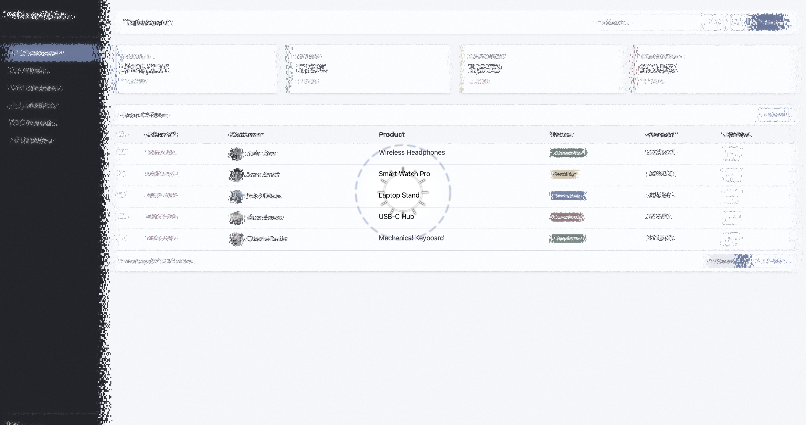
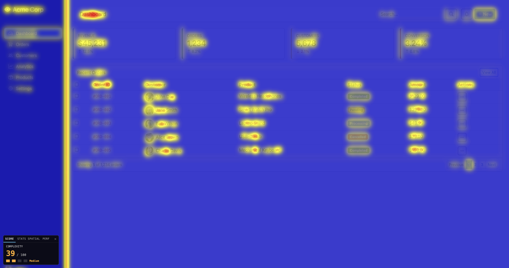
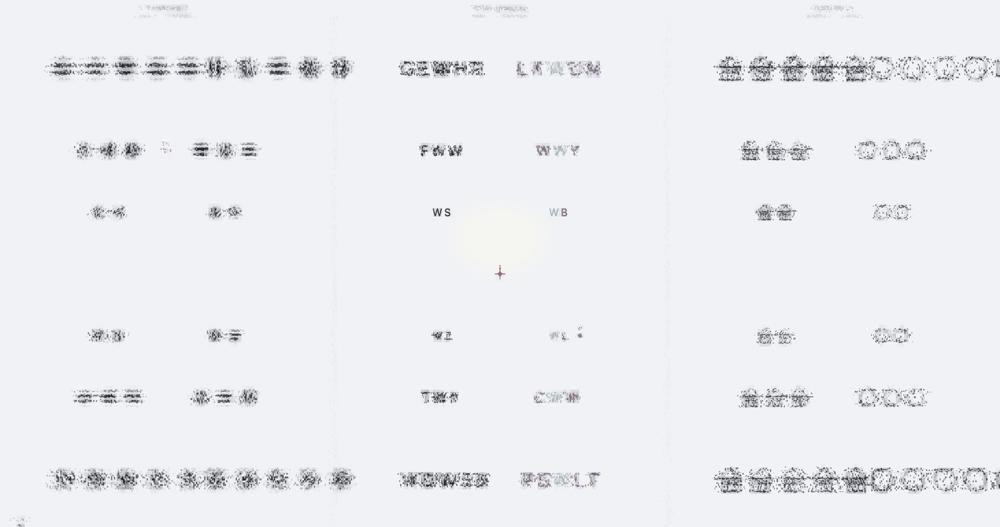
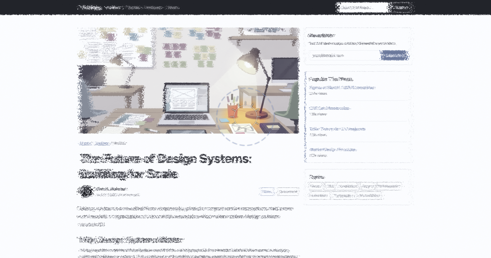

#  Scrutinizer — Foveated Vision Simulator

[](https://www.electronjs.org/)
[](https://developer.mozilla.org/en-US/docs/Web/API/WebGL_API)
[](LICENSE)

Live site: **[scrutinizer.app](https://andyed.github.io/scrutinizer-www/)** | [Blog](https://andyed.github.io/scrutinizer-www/blog/) | [YouTube](https://www.youtube.com/@scrutinizer-app/playlists)

macOS Installer: **[Download v2.3.0](https://github.com/andyed/scrutinizer2025/releases/tag/v2.3.0)** | [Changelog](CHANGELOG.md)

---

## What Scrutinizer Does

Your eyes only see fine detail right where you're looking — everything else is blurry, color-shifted, and crowded. Scrutinizer simulates this, rendering any web page through a model of how human vision actually works, bound to your mouse cursor. Move the cursor and watch the rest of the page degrade the way your peripheral vision does. The question it answers: what can a user actually see at a glance, before their eyes move?

> [!TIP]
> **For usability practitioners:** Scrutinizer works as a [Restricted Focus Viewer](https://pubmed.ncbi.nlm.nih.gov/12078741/) — evaluate peripheral discoverability, color reliance, and layout hierarchy without eye tracking hardware.



*A dashboard viewed through Scrutinizer. Cursor at center — detail and color fade with distance from fixation, and dense regions (text, grids) degrade more than isolated elements.*

| Congestion Heatmap | Crowding Stimulus | Article Page |
|:--:|:--:|:--:|
|  |  |  |
| Feature Congestion clutter map <sub>[original](screenshots/v23_dashboard_original.png)</sub> | Flanker letters at 3°, 6°, 10° <sub>[original](screenshots/v23_crowding_stimulus_original.png)</sub> | Blog article with foveated rendering <sub>[original](screenshots/v23_article_original.png)</sub> |

---

## An Experiment in AI-Assisted Vision Science

Scrutinizer is built with AI coding tools (Claude Code and Gemini) as research partners — AI synthesizes literature and drafts implementations; the human evaluates scientific defensibility.

The v2.1 [psychophysical validation](https://andyed.github.io/scrutinizer-www/blog/2026-03-08-v2.1.html) is a case study: in a single day, AI and human together digitized data from papers spanning 1970–2025 ([Rovamo 1979](tests/validation/published-data/rovamo_virsu1979_csf.json), [Hansen 2009](tests/validation/published-data/hansen2009_color_naming.json), [Mullen & Kingdom 2002](tests/validation/published-data/mullen_kingdom2002_rg_by.json), [Bowers 2025](tests/validation/published-data/bowers2025_sensitivity.json)), built stimulus pages recreating the original experiments, ran the full validation battery, and found three shader bugs that had survived months of visual testing. All published data, stimuli, and analysis scripts ship with the repo.

---

## Model Architecture

The rendering pipeline mirrors how the brain's visual pathway actually works — three processing stages, each doing something different to the image as it moves from eye to cortex. Full details in the [Biological Model](docs/foveated-vision-model.md).

| Stage | What it does | How Scrutinizer simulates it |
|-------|-------------|------------------------------|
| [**LGN** (relay)](docs/foveated-vision-model.md#stage-1-lgn-gating--masking) | Decides what gets through — suppresses blank areas, boosts important regions | Structure map (DOM analysis), [saliency modulation](docs/foveated-vision-model.md#cognitive-vs-retinal-constraint) |
| [**V1** (detail)](docs/foveated-vision-model.md#stage-2-v1-geometry--distortion) | Processes edges and spatial detail — resolution drops with distance from fixation, nearby elements crowd each other | 8 half-octave [DoG bands](https://andyed.github.io/scrutinizer-www/blog/mip-chain-explainer.html), [density-gated crowding](docs/specs/density_gated_crowding.md) |
| [**V4** (color)](docs/foveated-vision-model.md#stage-3-v4-aesthetics--style) | Handles color and object-level grouping — red-green fades before blue-yellow in periphery | Per-channel [chromatic decay](https://andyed.github.io/scrutinizer-www/blog/2026-02-28-fovi.html), coupled spatial pooling |

Resolution falloff across all stages follows a [cortical magnification function](https://andyed.github.io/scrutinizer-www/blog/2026-02-28-fovi.html) — a log-mapping that describes how the brain allocates disproportionate processing power to the center of gaze.

**DOM-aware rendering.** Scrutinizer reads the live DOM — grouping adjacent text nodes into paragraph clusters (Gestalt proximity), measuring local density from the node tree, and feeding that into the V1 crowding gate. A dense text column and an isolated heading at the same eccentricity get different treatment, because Rosenholtz's pooling regions compute different summary statistics over them.

**[Feature Congestion](https://andyed.github.io/scrutinizer-www/blog/congestion-score.html)** scoring runs alongside the pipeline, measuring visual clutter (color variance, edge density, contrast) to produce a 0–100 complexity score per region. See [congestion-journey.md](docs/congestion-journey.md).

**Calibration.** A [Motion Silence staircase](docs/foveal-calibration-logic.md) anchors the simulation to the user's actual perceptual foveal extent.

---

## Features

### Rendering Pipeline (v2.1)
- **8 half-octave DoG bands** — Difference-of-Gaussians peripheral reconstruction at √2 frequency spacing (5.66–0.5 cpd), validated against Rovamo & Virsu 1979
- **Foveal/peripheral simulation** — eccentricity-dependent spatial pooling and chromatic filtering bound to cursor position
- **[Analytical cortical magnification](https://andyed.github.io/scrutinizer-www/blog/2026-02-28-fovi.html)** — eccentricity falloff using the Schwartz (1980) log-mapping parameterization (mode 6), alongside legacy (mode 7) for comparison
- **[Feature Congestion](https://andyed.github.io/scrutinizer-www/blog/congestion-score.html) pipeline** — real-time visual clutter scoring with ComplexityHUD overlay (Score / Stats / Spatial tabs)
- **WebGPU compute mongrel synthesis** (Tier 2.5, experimental) — two-pass tile statistics extraction and oriented noise synthesis via WGSL compute shaders, with auto-fallback safety harness. Opt-in via Rendering menu; target default in next release.
- **Congestion-gated pooling** (mode 9) — peripheral attenuation weighted by local visual complexity
- **Saliency modulation** — allocates more peripheral bandwidth to salient regions (edges, contrast, high-importance areas)
- **Structure map analysis** — reads the live DOM to detect text rhythm, element density, font weight, and semantic type (ARIA roles), feeding the crowding and saliency stages
- **Visual memory simulation** — iconic memory decay across 5 modes (Off, Limited, Extended, Infinite, Fixation Buffer)

### Tools
- **Foveal Calibrator** — [online tool](https://andyed.github.io/scrutinizer-www/foveal-calibration.html) measuring perceptual foveal spread via Motion Silence psychophysics
- **scrutinizer-audit CLI** — headless Playwright-based site auditor: Feature Congestion scoring, batch URL evaluation, sitemap crawling, CI gating (`--fail-above N`), heatmap export
- **MCP server** — AI-assisted design review via `analyze_url`, `compare_pages`, and `capture_vision` tools (compatible with Claude Desktop, Cursor, and Windsurf)
- **Golden capture pipeline** — automated screenshot capture and SSIM/PSNR regression testing across versions

### Interface
- **Extensibility modes** — modular shader pipeline supports custom visual effects (Frosted Glass, Wireframe, Minecraft, Double Vision are included as test cases; see [Developer's Guide](docs/developers_guide.md))
- **Simulation menu** — organized into Behavior (cognitive), Foveal (spatial), Peripheral (rendering), and Utility (debug) groups
- **Eccentricity overlay** — boundary ring visualization for foveal/parafoveal/peripheral zones

### Platform
- **macOS**: Signed and notarized (v1.3+), Apple Silicon native
- **Figma plugin**: [Scrutinizer Pro](https://www.figma.com/community/plugin/1579671593390938191/scrutinizer-pro) — free with watermark, uses Figma DOM for prototype support

---

## Validation & Reproducibility

Scrutinizer validates each pipeline stage against published psychophysical data spanning 45 years of vision science.

### Psychophysical validation (v2.1)

Five waves test the shader against published human data. The pattern: render a known stimulus, measure output pixels at each eccentricity, compare against the original paper's measurements. Published data is digitized into machine-readable JSON in [`tests/validation/published-data/`](tests/validation/published-data/).

| Wave | Domain | Published basis | Key result |
|------|--------|-----------------|------------|
| 1 | Chromatic decay | [Hansen 2009](tests/validation/published-data/hansen2009_color_naming.json), [Mullen & Kingdom 2002](tests/validation/published-data/mullen_kingdom2002_rg_by.json) | RG/YV channel separation matches opponent-channel predictions |
| 2 | Spatial frequency | [Rovamo & Virsu 1979](tests/validation/published-data/rovamo_virsu1979_csf.json) | Frequency-selective attenuation (not uniform blur), r=0.600 composite |
| 3 | Crowding geometry | Bouma 1970, Toet & Levi 1992 | R:T bug found and fixed; density gate validated at 3.3:1 |
| 4 | Saliency protection | Itti & Koch 2001, Hershler 2005 | Face saliency 4.79× control; protection ratio 0.283 |
| 5 | Mixed-density UI | Halverson & Hornof 2011 | Density gate predicts same sparse/dense pattern as EPIC model |

15 HTML reference pages ship as open-source psychophysical stimuli. Each validation wave has a capture script (Electron headless) and an analysis script (pixel measurement). Blog post: [Measuring the Pipeline](https://andyed.github.io/scrutinizer-www/blog/2026-03-08-v2.1.html).

```bash
node scripts/capture-crowding.js        # Capture crowding stimuli through pipeline
node scripts/analyze-dog-bands.js       # Band weight analysis (pure math, no GPU)
```

### Regression testing

**Golden captures.** Automated screenshots at fixed viewport/URL/mode combinations, compared across versions using SSIM (≥0.98) and PSNR (≥35 dB) thresholds. The capture pipeline runs headlessly and produces paired comparison images stored in [`docs/golden/`](docs/golden/).

```bash
npm run capture-golden          # Generate reference captures
npm run golden-compare          # Compare current output against references
```

**[Feature Congestion](https://andyed.github.io/scrutinizer-www/blog/congestion-score.html) validation.** The JavaScript implementation is cross-validated against the Python reference (Rosenholtz lab toolbox) on matched test images. Spearman rank correlation ρ=0.93.

```bash
npm run validate:python         # Run Python reference (requires uv + Python 3.12)
npm run validate:scrutinizer    # Run Scrutinizer's JS implementation
```

**Methodology note.** Following the cross-validation approach advocated by Bowers et al. (2025), each pipeline stage is tested against its reference independently before integration. The simulation does not claim biological accuracy — it claims fidelity to the cited models, which are themselves approximations.

---

## Calibration

Default: `fovea_deg = 2.0`, `foveaRadius = 90px` (45 px/°) — within 2% on reference hardware (MBP Retina @ 50cm). At different viewing distances the fixed mapping diverges (±30–40%). The [Foveal Calibrator](https://andyed.github.io/scrutinizer-www/foveal-calibration.html) measures perceptual foveal extent via Motion Silence staircase but doesn't yet separate `px_per_deg` from comfort radius. *Fix path: [Project 1.3](docs/grad-student-projects.md).*

---

## Research Opportunities

Seventeen graduate-level projects are specified in [**grad-student-projects.md**](docs/grad-student-projects.md) — vision science, HCI, design tools, and systems work, each with effort level, novelty, and IRB requirements.

Key open specs: oriented DoG bands (1.1), texture synthesis (1.2), calibrated visual angles (1.3), saccadic dynamics (1.4), eye tracker integration (3.3). Contributions welcome — see the [Developer's Guide](docs/developers_guide.md).

---

## Known Limitations

1. **Calibration portability** — default mapping is accurate on reference hardware (MBP Retina @ 50cm); diverges at other viewing distances. *Fix: [Project 1.3](docs/grad-student-projects.md)*
2. **Approximate spatial pooling** — uses averaged pixel blocks, not the texture-like statistical summaries the brain preserves in peripheral vision. *Fix: [Project 1.2](docs/grad-student-projects.md)*
3. **Sequential color pipeline** — spatial averaging runs before color attenuation, slightly over-degrading mid-peripheral color. *Fix: [ROADMAP](ROADMAP.md)*
4. **No memory across fixations** — each fixation renders independently; the brain accumulates information across eye movements. Visual Memory modes approximate this. *See: [simulation-limitations.md](docs/simulation-limitations.md)*
5. **Mouse, not eyes** — cursor tracking (~200ms latency) approximates but doesn't replicate gaze fixation. *Fix: [Project 3.3](docs/grad-student-projects.md)*

Full gap analysis: [simulation-limitations.md](docs/simulation-limitations.md).

---

## Installation

### Download (v2.2.0)

> Scrutinizer for macOS is **Signed & Notarized** — no security warnings.

*   **macOS (Apple Silicon):** [**Download Scrutinizer-2.2.0.dmg**](https://github.com/andyed/scrutinizer2025/releases/tag/v2.2.0)
*   **Windows:** Manual build required (see [Releases Page](https://github.com/andyed/scrutinizer2025/releases))

[**View All Releases & Changelogs**](https://github.com/andyed/scrutinizer2025/releases)

<details>
<summary><strong>Troubleshooting macOS Warnings (Manual/Unsigned Builds Only)</strong></summary>

> The official release v1.3.0+ is signed and notarized. These steps only apply to source builds or older versions.

1.  Right-click `Scrutinizer.app` → **Open**.
2.  Click **Open** when warned about the unidentified developer.
3.  If blocked, go to **System Settings → Privacy & Security** and click **Open Anyway**.
4.  Advanced: `xattr -dr com.apple.quarantine /Applications/Scrutinizer.app`.
</details>

<details>
<summary><strong>Troubleshooting Windows SmartScreen</strong></summary>

1.  Run the installer.
2.  If SmartScreen appears, click **More info** → **Run anyway**.
</details>

### Developer Setup

```bash
npm install
npm start                       # Development mode
npm run build                   # Signed DMG (macOS)
npm test                        # Run test suite
```

### CLI Setup

```bash
# scrutinizer-audit — headless visual complexity auditor
node cli/scrutinizer-audit.js https://example.com
node cli/scrutinizer-audit.js --sitemap https://example.com/sitemap.xml --fail-above 70

# MCP server — AI-assisted design review. Works with Claude Desktop, Cursor, Windsurf, etc.
# Use the absolute path to `server.js` when configuring your LLM client.
# Example for Cursor/Windsurf: Command: `node /absolute/path/to/cli/mcp/server.js`
```

---

## Usage & Controls

### Basic Navigation
1. **Navigate** — use the toolbar URL bar to enter URLs or search terms
2. **Toggle simulation** — click the eye icon, press `Cmd+Shift+F`, or use Simulation → Foveal → Toggle
3. **Adjust radius** — Left/Right arrow keys, or use Simulation → Foveal → Radius
4. **Calibrate** — use the [Foveal Calibrator](https://andyed.github.io/scrutinizer-www/foveal-calibration.html) to measure your actual foveal spread

### Menu Structure

| Menu Group | Contents |
|------------|----------|
| **Behavior** | Visual Memory (5 modes), Structure Map, Saliency Modulation |
| **Foveal** | Toggle, Radius (6 sizes), Shape (4 aspect ratios) |
| **Peripheral** | Intensity (5 levels), Chromatic Aberration |
| **Utility** | Rendering modes, Structure Map view, Saliency Map view, Eccentricity Overlay |

### Keyboard Shortcuts

| Key | Action |
|-----|--------|
| `Cmd+Shift+F` | Toggle foveal simulation |
| `Right Arrow` | Increase foveal radius |
| `Left Arrow` | Decrease foveal radius |
| `Cmd+L` | Focus URL bar |

---

## Documentation

- [Biological Model](docs/foveated-vision-model.md) — receptor-to-cortex narrative, shader stage mapping
- [Scientific Literature Review](docs/scientific_literature_review.md) — full research foundations
- [Feature Congestion Journey](docs/congestion-journey.md) — implementation and validation log
- [How GPU MIP Chains Simulate Peripheral Vision](https://andyed.github.io/scrutinizer-www/blog/mip-chain-explainer.html) — blog post explaining the spatial decomposition pipeline
- [FOVI & Cortical Magnification](https://andyed.github.io/scrutinizer-www/blog/2026-02-28-fovi.html) — blog post on the v1.7 CMF integration and chromatic attenuation
- [Feature Congestion Scoring](https://andyed.github.io/scrutinizer-www/blog/congestion-score.html) — blog post on the clutter metric
- [v2.1: Measuring the Pipeline](https://andyed.github.io/scrutinizer-www/blog/2026-03-08-v2.1.html) — five-wave psychophysical validation, 8 half-octave DoG bands
- [v1.8: Scientific Accuracy Audit](https://andyed.github.io/scrutinizer-www/blog/2026-03-03-v1.8.html) — blog post on M-scaling corrections and Feature Congestion launch
- [Foveal Calibration Logic](docs/foveal-calibration-logic.md) — psychophysics of the calibration tool
- [Simulation Limitations](docs/simulation-limitations.md) — detailed gap analysis
- [Developer's Guide](docs/developers_guide.md) — architecture, extension patterns, adding custom modes

---

## Acknowledgments

- **[face-api.js](https://github.com/vladmandic/face-api)** (v1.7.15, Vladimir Mandic) — TinyFaceDetector powers the face channel in the saliency pipeline. MIT license.
- **[Rosenholtz Lab](https://persci.mit.edu/people/rosenholtz/)** — Feature Congestion metric, Texture Tiling Model, and peripheral vision research that grounds this project.
- **[FOVI](https://arxiv.org/abs/2602.03766)** (Blauch, Alvarez & Konkle) — cortical magnification parameterization adopted in v1.7.
- **[castleCSF](https://doi.org/10.1167/jov.24.4.5)** (Ashraf et al.) — per-channel chromatic contrast sensitivity functions.
- **[arXiv](https://arxiv.org/)** — open preprint infrastructure. Multiple foundational papers (FOVI, castleCSF) were accessible because researchers posted preprints.

## License

Copyright (c) 2012–2026, Andy Edmonds. All rights reserved.
Licensed under the [MIT License](LICENSE).
