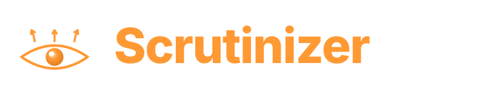
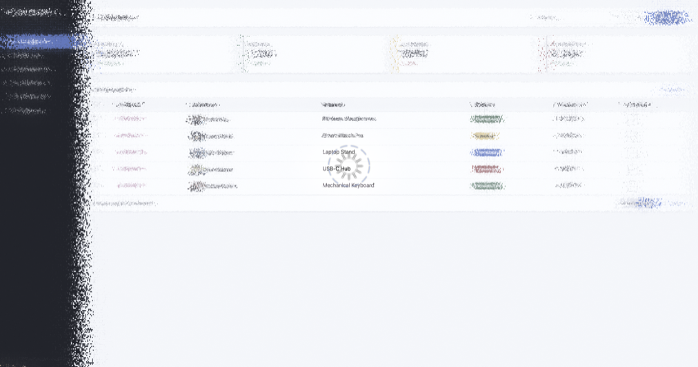
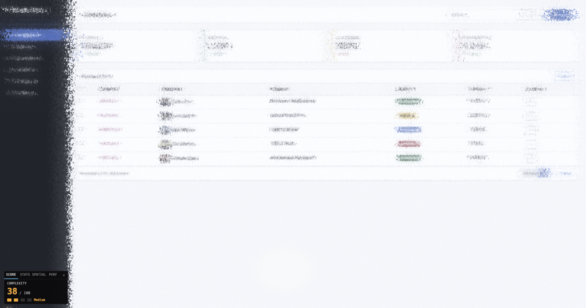
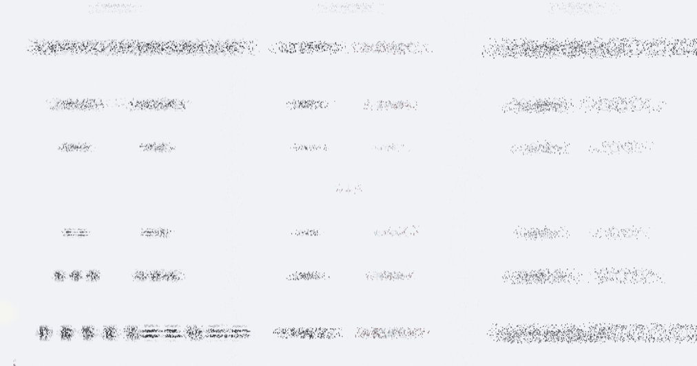
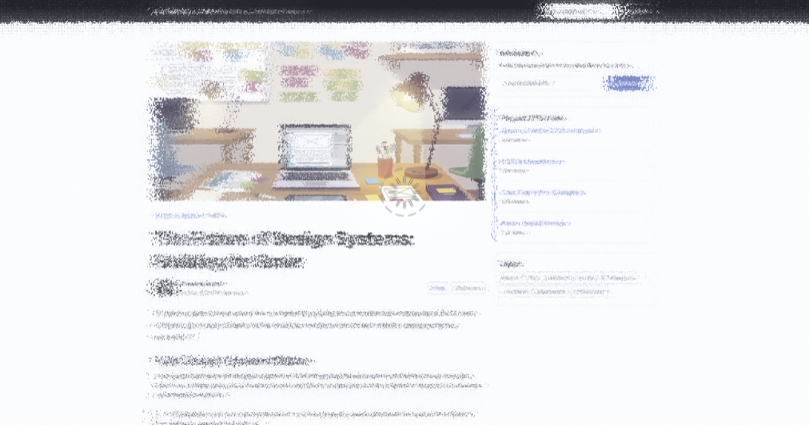

<p align="left">
  
</p>

# Foveated Vision Simulator

[](https://www.electronjs.org/)
[](https://developer.mozilla.org/en-US/docs/Web/API/WebGL_API)
[](https://developer.mozilla.org/en-US/docs/Web/API/WebGPU_API)
[](LICENSE)

Live site: **[scrutinizer.app](https://andyed.github.io/scrutinizer-www/)** | [Blog](https://andyed.github.io/scrutinizer-www/blog/) | [YouTube](https://www.youtube.com/@scrutinizer-app/playlists)

macOS Installer: **[Download v2.8.0](https://github.com/andyed/scrutinizer2025/releases/tag/v2.8.0)** | [Changelog](CHANGELOG.md)

**AI agents & CLI users:** See [**CLI & Automation**](cli/README.md) for visual complexity scoring, MCP server, saliency export, headless capture pipeline, and 75+ automation scripts with output schemas and env var reference.

---

## What Scrutinizer Does

Scrutinizer lets a researcher **control and reveal visual focus** during a usability task. Its biologically motivated peripheral rendering aims to approximate the visual information available for planning the next eye movement. Fine detail is available around the participant's pointer; away from it, acuity and color sensitivity fall and crowding increases. The participant uses that modeled peripheral information to decide where to move next, then brings the selected region into focus.

This creates an active-vision loop: current foveal and peripheral view → next target selection → pointer movement as an emulated gaze shift → new foveal information and Visual Memory → the next decision. The researcher sees the same constrained page and can observe which regions the participant chooses to reveal, in what order, and where the interface fails to provide useful peripheral guidance.

> [!TIP]
> **For usability practitioners:** Scrutinizer works as a [Restricted Focus Viewer](https://pubmed.ncbi.nlm.nih.gov/12723780/) (Jansen et al. 2003). Participant and researcher share a scientifically motivated foveal-plus-peripheral stimulus, so “see what your user sees” becomes an operational procedure, and pointer movement emulates the change in fixation that it helps plan. Use it to evaluate peripheral discoverability, color reliance, visual hierarchy, and focus transitions without eye-tracking hardware. Start with the [RFV setup and calibration guide](docs/tutorials/getting-started-rfv.md), then use the [usability-testing practitioner guide](docs/tutorials/usability-testing-practitioner-guide.md) to prepare reproducible Study Links and moderated sessions.



*A dashboard viewed through Scrutinizer. Fixation circle at center. Detail and color fade with distance from fixation, and dense regions (text, grids) degrade more than isolated elements.*

| Congestion Heatmap | Crowding Stimulus | Article Page |
|:--:|:--:|:--:|
|  |  |  |
| Feature Congestion clutter map + score overlay <br><sub>([original](screenshots/v25_dashboard.png))</sub> | Flanker letters at 3°, 6°, 10° <br><sub>([original](screenshots/v23_crowding_stimulus_original.png))</sub> | Blog article with foveated rendering <br><sub>([original](screenshots/v25_article.png))</sub> |

---

## An Experiment in AI-Assisted Vision Science

Scrutinizer is built with AI coding tools (Claude Code and Gemini) as research partners: AI synthesizes literature and drafts implementations; the human evaluates scientific defensibility.

The v2.1 [psychophysical validation](https://andyed.github.io/scrutinizer-www/blog/2026-03-08-v2.1.html) is a case study. In a single day, AI and human together digitized data from papers spanning 1970–2025 ([Rovamo 1979](tests/validation/published-data/rovamo_virsu1979_csf.json), [Hansen 2009](tests/validation/published-data/hansen2009_color_naming.json), [Mullen & Kingdom 2002](tests/validation/published-data/mullen_kingdom2002_rg_by.json), [Bowers 2025](tests/validation/published-data/bowers2025_sensitivity.json)) and built stimulus pages recreating the original experiments. The full validation battery found three shader bugs that months of visual testing had missed. All published data, stimuli, and analysis scripts ship with the repo.

---

## Model Architecture

The rendering pipeline is organized after three stages of the visual pathway, each doing something different to the image as it moves from eye to cortex. Full details in the [Biological Model](docs/foveated-vision-model.md).

| Stage | What it does | How Scrutinizer simulates it |
|-------|-------------|------------------------------|
| [**LGN** (relay)](docs/foveated-vision-model.md#stage-1-lgn-gating--masking) | Relays retinal signals to cortex; attention modulates what gets through | Blank areas suppressed via the structure map (DOM analysis); important regions boosted via [saliency modulation](docs/foveated-vision-model.md#cognitive-vs-retinal-constraint) |
| [**V1** (detail)](docs/foveated-vision-model.md#stage-2-v1-geometry--distortion) | Processes edges and spatial detail: resolution drops with distance from fixation, and nearby elements crowd each other | 12 half-octave [DoG bands](https://andyed.github.io/scrutinizer-www/blog/mip-chain-explainer.html), [density-gated crowding](docs/specs/implemented/density_gated_crowding.md) |
| [**V4** (color)](docs/foveated-vision-model.md#stage-3-v4-aesthetics--style) | Handles color and object-level grouping | Per-channel [chromatic decay](https://andyed.github.io/scrutinizer-www/blog/2026-04-25-peripheral-color.html) (red-green fades before blue-yellow; retinal in origin, simulated at this stage), coupled spatial pooling |

Resolution falloff across all stages follows a [cortical magnification function](https://andyed.github.io/scrutinizer-www/fovi.html), a log-mapping that describes how the brain allocates disproportionate cortical area to the center of gaze.

**DOM-aware rendering.** Scrutinizer reads the live DOM, groups adjacent text nodes into paragraph clusters (Gestalt proximity), measures local density from the node tree, and passes that density to the V1 crowding gate. A dense text column and an isolated heading at the same eccentricity get different treatment, because the crowding gate scales with local density. The gate approximates Rosenholtz's pooling account of crowding without computing its summary statistics.

**[Feature Congestion](https://andyed.github.io/scrutinizer-www/blog/congestion-score.html)** scoring runs alongside the pipeline, measuring visual clutter (color variance, edge density, contrast) to produce a 0–100 complexity score per region. See [congestion-journey.md](docs/congestion-journey.md).

**Calibration.** The online [Foveal Calibrator](https://andyed.github.io/scrutinizer-www/foveal-calibration.html) measures the user's perceptual foveal extent with a [Motion Silence staircase](docs/foveal-calibration-logic.md). The desktop app does not import the result; set the radius by hand under Simulation → Foveal → Foveal Radius.

---

## Features

### Rendering Pipeline (v2.7)
- **12 half-octave DoG bands:** Difference-of-Gaussians peripheral reconstruction at √2 frequency spacing (5.66–0.088 cpd), tested against Rovamo & Virsu 1979 in Wave 2
- **Foveal/peripheral simulation:** eccentricity-dependent spatial pooling and chromatic filtering bound to cursor position
- **[Isotropic cortical magnification](https://andyed.github.io/scrutinizer-www/blog/2026-03-21-v2.6.html):** FOVI-derived cortical sectors (Blauch, Alvarez & Konkle 2026) parameterize displacement noise frequency and scramble cell size
- **[Feature Congestion](https://andyed.github.io/scrutinizer-www/blog/congestion-score.html) pipeline:** real-time visual clutter scoring with ComplexityHUD overlay (Score / Stats / Spatial tabs)
- **Eccentricity-weighted congestion:** two-scale Feature Congestion with foveal (1024px, σ=2.5) and peripheral (128px, σ=5.0) scales, blended by eccentricity. Peripheral clutter is measured at the resolution the visual system can resolve there.
- **Resolution-gated saliency:** saliency protection is scaled with eccentricity by an acuity-decay function (Strasburger et al. 2011). Features must be proportionally more conspicuous to survive at higher eccentricities. Saliency-aware scramble zone preserves high-saliency content (product images, faces) from aggressive displacement.
- **WebGPU pyramid synthesis** (Tier 2.75): 4-scale Laplacian pyramid decomposition with cross-scale magnitude correlation matching via WGSL compute shaders. Falls back to the WebGL MIP/DoG path when WebGPU is unavailable or the GPU lacks the 9 storage buffers the pyramid needs.
- **Congestion-gated pooling:** peripheral attenuation weighted by local visual complexity, blending Bouma-scaled edge density with eccentricity-weighted congestion
- **Saliency modulation:** allocates more peripheral bandwidth to salient regions (edges, contrast, high-importance areas)
- **Structure map analysis:** reads the live DOM to detect text rhythm, element density, font weight, and semantic type (ARIA roles), feeding the crowding and saliency stages
- **Visual memory simulation:** previously fixated regions stay clear, across 5 modes (Off, Limited, Extended, Infinite, Inhibition of Return)

### Tools
- **Foveal Calibrator:** [online tool](https://andyed.github.io/scrutinizer-www/foveal-calibration.html) measuring perceptual foveal spread via Motion Silence psychophysics
- **scrutinizer-audit CLI:** headless Playwright-based site auditor for Feature Congestion scoring, batch URL evaluation, sitemap crawling, CI gating (`--fail-above N`), heatmap export
- **MCP server:** AI-assisted design review via `analyze_url`, `analyze_urls`, `compare_pages`, and `capture_vision` tools (compatible with Claude Desktop, Cursor, and Windsurf)
- **Golden capture pipeline:** automated screenshot capture and SSIM/PSNR regression testing across versions

### Interface
- **Extensibility modes:** modular shader pipeline supports custom visual effects (Frosted Glass, Wireframe, Minecraft, Drunken Reading are included as test cases; see [Developer's Guide](docs/developers_guide.md))
- **Simulation menu:** organized into Behavior (cognitive), Foveal (spatial), Peripheral (rendering), and Utility (debug) groups
- **Eccentricity overlay:** boundary ring visualization for foveal/parafoveal/peripheral zones

### Platform
- **macOS**: Signed and notarized (v1.3+), Apple Silicon native
- **Figma plugin**: [Scrutinizer Pro](https://www.figma.com/community/plugin/1579671593390938191/scrutinizer-pro), free with watermark; uses the Figma DOM for prototype support

---

## Validation & Reproducibility

Five validation waves test the chromatic, spatial-frequency, crowding, saliency and mixed-density stages against published data from 1970–2025. Mode 17 length-tuning, the oblique effect, and the isolated-versus-flanked crowding asymmetry (Wave 7c) are not yet validated against human data.

### Psychophysical validation (v2.1)

Five waves test the shader against published human data. Each wave renders a known stimulus, measures output pixels at each eccentricity, and compares them against the original paper's measurements. Published data is digitized into machine-readable JSON in [`tests/validation/published-data/`](tests/validation/published-data/).

| Wave | Domain | Published basis | Key result |
|------|--------|-----------------|------------|
| 1 | Chromatic decay | [Hansen 2009](tests/validation/published-data/hansen2009_color_naming.json), [Mullen & Kingdom 2002](tests/validation/published-data/mullen_kingdom2002_rg_by.json) | RG/YV channel separation matches opponent-channel predictions |
| 2 | Spatial frequency | [Rovamo & Virsu 1979](tests/validation/published-data/rovamo_virsu1979_csf.json) | Frequency-selective attenuation (not uniform blur), r=0.600 composite (below the r>0.9 Tier 3 target) |
| 3 | Crowding geometry | Bouma 1970, Toet & Levi 1992 | R:T bug found and fixed; density gate validated at 3.3:1 |
| 4 | Saliency protection | Itti & Koch 2001, Hershler 2005 | Face saliency 4.79× control; protection ratio 0.283 |
| 5 | Mixed-density UI | Halverson & Hornof 2011 | Near-before-far eccentricity gradient matches the EPIC model; sparse/dense discrimination not met (block-level density gate vs. word-level density in EPIC) |

15 HTML reference pages ship as open-source psychophysical stimuli. Each validation wave has a capture script (Electron headless) and an analysis script (pixel measurement). Blog post: [Measuring the Pipeline](https://andyed.github.io/scrutinizer-www/blog/2026-03-08-v2.1.html).

```bash
node scripts/capture-crowding.js        # Capture crowding stimuli through pipeline
node scripts/analyze-dog-bands.js       # Band weight analysis (pure math, no GPU)
```

### Regression testing

**Golden captures.** Automated screenshots at fixed viewport/URL/mode combinations. `npm run golden-compare` scores browser captures against matching Figma-plugin captures, and `--regression --base=<dir> --target=<dir>` compares two capture sets; both default to SSIM ≥0.98 and PSNR ≥35 dB. Comparisons are run manually and are not part of CI. The default mode writes browser captures and summary metrics to [`docs/golden/`](docs/golden/).

```bash
npm run capture-golden          # Generate reference captures
npm run golden-compare          # Compare browser captures against Figma-plugin captures
```

**[Feature Congestion](https://andyed.github.io/scrutinizer-www/blog/congestion-score.html) validation.** The JavaScript implementation is cross-validated against `visual-clutter`, a Python port of the Rosenholtz lab's MATLAB toolbox, on matched test images. Spearman rank correlation ρ=0.93.

```bash
npm run validate:python         # Run Python reference (requires uv + Python 3.12)
npm run validate:scrutinizer    # Run Scrutinizer's JS implementation
```

**Methodology note.** Following the cross-validation approach advocated by Bowers et al. (2025), each pipeline stage is tested against its reference independently before integration. Fidelity is claimed to the cited models, which are themselves approximations. Biological accuracy is not claimed.

---

## Calibration

Default: `fovea_deg = 1.0`, `foveaRadius = 45px` (45 px/°), accurate to within 2% on reference hardware (MBP Retina @ 50cm). At different viewing distances the fixed mapping diverges (±30–40%). The [Foveal Calibrator](https://andyed.github.io/scrutinizer-www/foveal-calibration.html) measures perceptual foveal extent via Motion Silence staircase but doesn't yet separate `px_per_deg` from comfort radius. *Fix path: [Project 1.3](docs/research-opportunities.md).*

---

## Research Opportunities

Seventeen research directions are described in [**research-opportunities.md**](docs/research-opportunities.md), covering vision science, HCI, design tools, and systems work, with research questions, publication venues, and infrastructure pointers.

Key open specs: oriented DoG bands (1.1), texture synthesis (1.2), calibrated visual angles (1.3), saccadic dynamics (1.4), eye tracker integration (3.3). Contributions are welcome; see the [Developer's Guide](docs/developers_guide.md).

---

## Known Limitations

1. **Calibration portability:** default mapping is accurate on reference hardware (MBP Retina @ 50cm); diverges at other viewing distances. *Fix: [Project 1.3](docs/research-opportunities.md)*
2. **Approximate spatial pooling:** uses averaged pixel blocks. The brain preserves texture-like statistical summaries in peripheral vision, and the renderer does not compute them. *Fix: [Project 1.2](docs/research-opportunities.md)*
3. **Sequential color pipeline:** spatial averaging runs before color attenuation, slightly over-degrading mid-peripheral color. *Fix: [ROADMAP](ROADMAP.md)*
4. **Limited memory across fixations:** the periphery is re-rendered at each fixation, while the brain accumulates information across eye movements. Visual Memory modes (off by default) keep previously fixated regions clear, which approximates part of this. *See: [simulation-limitations.md](docs/simulation-limitations.md)*
5. **Pointer-controlled focus:** in an RFV session, the pointer defines where detailed information is available and therefore reveals the participant's functional focus. It does not measure covert attention or exact eye position. Eye-tracker integration can add that separate signal. *See: [Project 3.3](docs/research-opportunities.md)*

Full gap analysis: [simulation-limitations.md](docs/simulation-limitations.md).

---

## Installation

### Download (v2.8.0)

> Scrutinizer for macOS is **Signed & Notarized** and opens without security warnings.

*   **macOS (Apple Silicon):** [**Download Scrutinizer-2.8.0.dmg**](https://github.com/andyed/scrutinizer2025/releases/tag/v2.8.0)
*   **Windows:** Manual build required (see [Releases Page](https://github.com/andyed/scrutinizer2025/releases))

[**View All Releases & Changelogs**](https://github.com/andyed/scrutinizer2025/releases)

<details>
<summary><strong>Troubleshooting macOS Warnings (Manual/Unsigned Builds Only)</strong></summary>

> The official release v1.3.0+ is signed and notarized. These steps only apply to source builds or older versions.

1.  Right-click `Scrutinizer.app` → **Open**.
2.  Click **Open** when warned about the unidentified developer.
3.  If blocked, go to **System Settings → Privacy & Security** and click **Open Anyway**.
4.  Advanced: `xattr -dr com.apple.quarantine /Applications/Scrutinizer.app`.
</details>

<details>
<summary><strong>Troubleshooting Windows SmartScreen</strong></summary>

1.  Run the installer.
2.  If SmartScreen appears, click **More info** → **Run anyway**.
</details>

### Developer Setup

```bash
npm install
npm start                       # Development mode
npm run build                   # Signed DMG (macOS)
npm test                        # Run test suite
```

### CLI Setup

```bash
# scrutinizer-audit — headless visual complexity auditor
node cli/scrutinizer-audit.js https://example.com
node cli/scrutinizer-audit.js --sitemap https://example.com/sitemap.xml --fail-above 70

# MCP server — AI-assisted design review. Works with Claude Desktop, Cursor, Windsurf, etc.
# Use the absolute path to `server.js` when configuring your LLM client.
# Example for Cursor/Windsurf: Command: `node /absolute/path/to/cli/mcp/server.js`
```

---

## Usage & Controls

### Basic Navigation
1. **Navigate:** use the toolbar URL bar to enter URLs or search terms
2. **Toggle simulation:** click the eye icon, press `Cmd+Shift+F`, or use Simulation → Foveal → Toggle
3. **Adjust radius:** Left/Right arrow keys, or use Simulation → Foveal → Radius
4. **Calibrate:** use the [Foveal Calibrator](https://andyed.github.io/scrutinizer-www/foveal-calibration.html) to measure your actual foveal spread

### Menu Structure

| Menu Group | Contents |
|------------|----------|
| **Behavior** | Visual Memory (5 modes), Structure Map, Saliency Modulation |
| **Foveal** | Toggle, Radius (9 sizes), Shape (4 aspect ratios) |
| **Peripheral** | Degradation Strength (5 levels) |
| **Utility** | Rendering modes, Structure Map view, Saliency Map view, Eccentricity Overlay |

### Keyboard Shortcuts

| Key | Action |
|-----|--------|
| `Cmd+Shift+F` | Toggle foveal simulation |
| `Right Arrow` | Increase foveal radius |
| `Left Arrow` | Decrease foveal radius |
| `Cmd+L` | Focus URL bar |

---

## Documentation

- [Biological Model](docs/foveated-vision-model.md): receptor-to-cortex narrative, shader stage mapping
- [Scientific Literature Review](docs/scientific_literature_review.md): full research foundations
- [Feature Congestion Journey](docs/congestion-journey.md): implementation and validation log
- [How GPU MIP Chains Simulate Peripheral Vision](https://andyed.github.io/scrutinizer-www/blog/mip-chain-explainer.html): blog post explaining the spatial decomposition pipeline
- [FOVI & Cortical Magnification](https://andyed.github.io/scrutinizer-www/fovi.html): interactive visualization of the FOVI cortical magnification function
- [Feature Congestion Scoring](https://andyed.github.io/scrutinizer-www/blog/congestion-score.html): blog post on the clutter metric
- [v2.1: Measuring the Pipeline](https://andyed.github.io/scrutinizer-www/blog/2026-03-08-v2.1.html): five-wave psychophysical validation, 8 half-octave DoG bands
- [v1.8: Scientific Accuracy Audit](https://andyed.github.io/scrutinizer-www/blog/2026-03-03-v1.8.html): blog post on M-scaling corrections and Feature Congestion launch
- [Foveal Calibration Logic](docs/foveal-calibration-logic.md): psychophysics of the calibration tool
- [Simulation Limitations](docs/simulation-limitations.md): detailed gap analysis
- [Developer's Guide](docs/developers_guide.md): architecture, extension patterns, adding custom modes

---

## Acknowledgments

- **[face-api.js](https://github.com/vladmandic/face-api)** (v1.7.15, Vladimir Mandic): TinyFaceDetector provides face detection for the face channel in the saliency pipeline. MIT license.
- **[Rosenholtz Lab](https://persci.mit.edu/people/rosenholtz/):** Feature Congestion metric, Texture Tiling Model, and the peripheral vision research this project is based on.
- **[FOVI](https://arxiv.org/abs/2602.03766)** (Blauch, Alvarez & Konkle): cortical magnification parameterization adopted in v1.7.
- **[castleCSF](https://doi.org/10.1167/jov.24.4.5)** (Ashraf et al.): per-channel chromatic contrast sensitivity functions.
- **[arXiv](https://arxiv.org/):** open preprint infrastructure. Multiple foundational papers (FOVI, castleCSF) were accessible because researchers posted preprints.

## License

Copyright (c) 2012–2026, Andy Edmonds. All rights reserved.
Licensed under the [MIT License](LICENSE).
