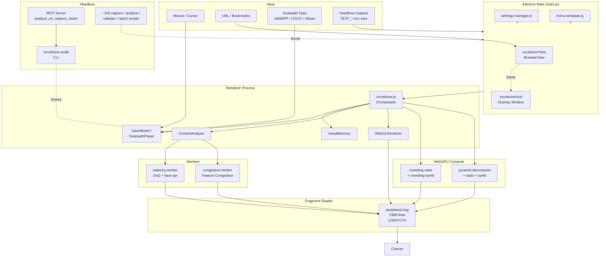
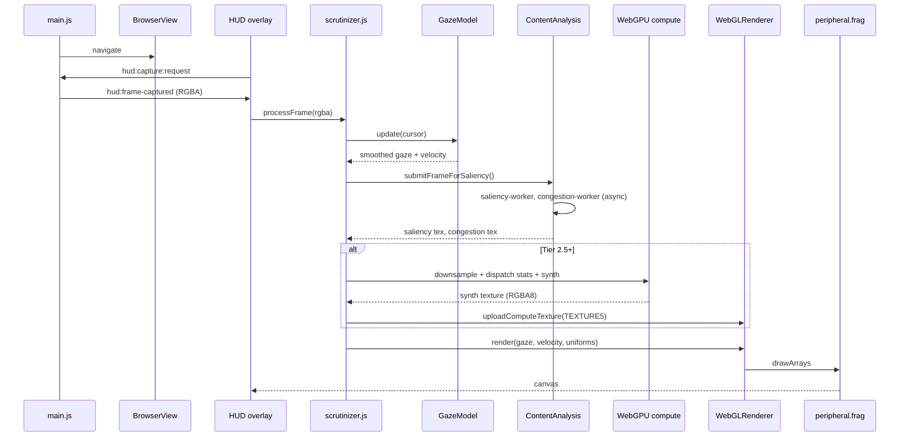
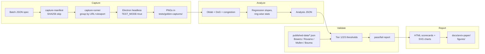

# Scrutinizer 2025 — Codebase Map

> Auto-generated by Cartographer on 2026-05-25. ~1.15M tokens across 405 tracked files (after skipping binaries, datasets, screenshots, and the `.understand-anything` graph itself). Companion artifact: `.understand-anything/knowledge-graph.json` (882 nodes / 791 edges, generated separately by `/understand`).

Scrutinizer is a foveated-vision research instrument built on Electron + WebGL 2.0 + WebGPU compute. It renders any web page through a three-stage cortical model of human peripheral vision (LGN → V1 → V4) bound to the mouse cursor. It is a primary research instrument with an arXiv paper, not a demo.

The codebase combines four world-class subsystems: a biologically-grounded shader pipeline (Burt-Adelson pyramids, Portilla-Simoncelli statistics, Schwartz cortical magnification, Bowers chromatic decay), a Playwright/Electron headless capture-and-validate toolchain wired to seven psychophysics validation waves, a headless CLI + MCP server for AI-assisted design review, and a scanpath-replay system covering AdSERP, COCO-Search18, and UEyes datasets.

---

## System Overview



**The single orchestrator is `renderer/scrutinizer.js`** — it wires the gaze model, visual memory, content analysis, and WebGPU compute into the WebGL render loop. The fragment shader (`renderer/shaders/peripheral.frag`, 2388 lines) is where the LGN → V1 → V4 model actually executes.

**The Electron shell uses a two-window architecture**: `scrutinizerView` (BrowserView holding the page being analyzed) and `scrutinizerHud` (transparent overlay holding the canvas + toolbar). All navigation/capture flows through main.js IPC channels.

**The headless toolchain mirrors the live app** for reproducibility — scripts spawn Electron with `TEST_MODE=true` and a JSON batch spec, drive captures, and feed analyzers that compare against published psychophysics ground truth.

---

## Directory Structure

```
scrutinizer2025/
├── main.js                          # Electron main (28k tokens, ~880 LOC)
├── menu-template.js                 # Native menu builder (9k tokens)
├── settings-manager.js              # User-settings persistence + migrations
├── package.json, jest.config.js, pyproject.toml
├── README.md, ROADMAP.md, TODO.md, CHANGELOG.md
│
├── renderer/                        # Renderer process (46f, 136k tokens core)
│   ├── scrutinizer.js              # Single orchestrator
│   ├── overlay.js, app.js          # HUD bootstrap + toolbar
│   ├── webgl-renderer.js           # GL context, uniforms, drawcall
│   ├── webgpu-crowding-compute.js  # Tier 2.5 (stats + synth)
│   ├── webgpu-pyramid-compute.js   # Tier 2.75 (Laplacian pyramid)
│   ├── webgpu-probe.js, webgpu-safety.js
│   ├── gaze-model.js               # Smoothed cursor + velocity
│   ├── visual-memory.js            # FIFO fixation buffer
│   ├── content-analysis.js         # Saliency + congestion orchestrator
│   ├── congestion-core.js          # Rosenholtz Feature Congestion
│   ├── color-saliency-map.js, oklab-utils.js
│   ├── gestalt-processor.js, structure-map.js, primitive-map.js
│   ├── dom-primitive-classifier.js, dom-adapter.js
│   ├── saliency-worker.js, congestion-worker.js
│   ├── config.js                   # Magic numbers (foveal radius, decays)
│   ├── foveal-calibration.{html,js}
│   ├── complexity-hud.js, frame-timer.js, citation-export.js
│   ├── shaders/                    # 7f, 56k tokens
│   │   ├── peripheral.frag         # 2388 lines: LGN/V1/V4 model
│   │   ├── peripheral.vert         # Fullscreen quad
│   │   ├── crowding-stats.wgsl     # Tier 2.5 pass 1
│   │   ├── crowding-synth.wgsl     # Tier 2.5 pass 2
│   │   ├── pyramid-decompose.wgsl  # Tier 2.75: Laplacian
│   │   ├── pyramid-stats.wgsl      # Tier 2.75: P-S statistics
│   │   └── pyramid-synth.wgsl      # Tier 2.75: iterative synthesis
│   ├── scanpath/                   # 5f — gaze-replay imports
│   │   ├── coordinate-utils.js     # Bahill saccade math + space conversions
│   │   ├── scanpath-types.js
│   │   └── importers/
│   │       ├── adserp-importer.js  # 2776 trials, page-vs-screen scroll math
│   │       ├── coco-search18-importer.js  # 6202 imgs × 10 subj
│   │       └── ueyes-importer.js   # Gazepoint normalized coords
│   ├── lib/                        # smaller helpers
│   └── assets/                     # face-api model + icons (binary)
│
├── shared/                         # Cross-process constants
│   ├── constants.json              # RADIUS / ASPECT / INTENSITY / DEVICE_PROFILES
│   └── modes.json                  # 16 aesthetic modes (declarative pipeline config)
│
├── cli/                            # Headless audit + MCP server
│   ├── scrutinizer-audit.js        # CLI entry (Lighthouse-for-clutter)
│   ├── lib/
│   │   ├── analyzer.js             # Shares Oklab + congestion-core
│   │   ├── crawler.js              # Playwright capture
│   │   ├── reporter.js             # JSON / HTML / table
│   │   ├── scroll-strategy.js, url-resolver.js, sitemap-parser.js
│   │   └── viewport-profiles.js
│   ├── mcp/server.js               # MCP stdio: analyze_url, compare_pages, capture_vision
│   └── templates/                  # HTML report templates
│
├── scripts/                        # ~100 files, 280k tokens — research toolchain
│   ├── capture-*.{js,py}           # ~20 capture scripts (per psychophysics wave)
│   ├── analyze-*.{js,py}           # ~14 analyzers
│   ├── validate-*.{js,py}          # ~12 validators (Tier 1/2/3 thresholds)
│   ├── compare-*.{js,py}           # Brown-metamer / mode / texture comparisons
│   ├── report-*.js                 # Paper-figure generators
│   ├── mind2web-*.{js,py}          # Multimodal Mind2Web pipeline
│   ├── replay-*.js, visualize-*.js, generate-*.js
│   ├── notarize.js, build-signed.js, run-electron.js  # release tooling
│   ├── lib/                        # capture-manifest, capture-runner, image-analysis, png-draw
│   ├── agents/validation-adversary.md  # Falsifiability methodology
│   └── archive/                    # mind2web-render-v1.js (superseded)
│
├── tests/                          # Jest (NOT Vitest)
│   ├── unit/                       # 25 tests: math + algorithms
│   ├── validation/                 # Multi-wave validation harness
│   │   ├── published-data/         # 8 JSON refs: Bowers, Rovamo, Mullen, Bouma, Toet, Hansen, Pelli, Harrington
│   │   ├── blur-isotropy/, mind2web/, reports/
│   ├── verification/, golden/      # SSIM/PSNR golden baselines
│   ├── reference-pages/            # 16 HTML stimuli (article, dashboard, color-spectrum, etc.)
│   ├── golden-captures/v{2.3..2.7} # Per-release regression suites (1622 files total)
│   ├── crowding-captures/tier3/    # Tier-3 stimulus PNGs
│   ├── smoke-captures/, compute-captures/, temporal-variance/
│   └── visual-test.html, memory-test.html, perf-test.html
│
├── data/                           # coco-search18, mind2web-summaries (skipped from scan)
│
├── docs/                           # 128+ markdown files, see §11
│   ├── foveated-vision-model.md    # ★ intellectual core
│   ├── developers_guide.md         # ★ onboarding
│   ├── architecture-layer-stack.md, architecture-module-pattern.md
│   ├── coordinate_systems.md, adserp-coordinate-system.md
│   ├── foveal-calibration-logic.md
│   ├── known-issues.md, MILESTONE-v2.4.1.md, next-steps-2026-04.md
│   ├── meeting-prep-rosenholtz-blauch.md
│   ├── arxiv-paper/                # scrutinizer-system-paper.{tex,pdf} + figures
│   ├── specs/                      # 16 feature specs (+ implemented/ 26 files)
│   ├── ai-source/, assessments/, archive/, tutorials/
│   └── golden/, blog-assets/, assets/ (skipped from scan)
│
├── assets/, output/, screenshots/  # build + capture outputs
└── .understand-anything/           # knowledge-graph.json (882 nodes) — sibling artifact
```

---

## The Three-Stage Vision Model (Intellectual Core)

The shader pipeline implements neuro-inspired cortical staging. Every parameter maps to a citation; refactoring should preserve this traceability.

**Stage 1 — LGN (Lateral Geniculate Nucleus): Gating**
- Spatial attention via structure-map masking (`renderer/structure-map.js`)
- Saliency-driven modulation (DoG center-surround + face-api in `saliency-worker.js`)
- Visual memory: FIFO fixation buffer (`visual-memory.js`) — soft persistence OR inhibition-of-return
- Blocks low-contrast features outside fovea via dynamic threshold masks

**Stage 2 — V1 (Primary Visual Cortex): Distortion**
- **Cortical magnification (Blauch FOVI):** log-polar mapping with `a = 2.78°`
  - `mip_level = max_mip × [ln(r + a) − ln(a)] / [ln(r_max + a) − ln(a)]`
  - Implemented at `webgl-renderer.js:888-901` and `peripheral.frag:551-565`
- **DoG band decomposition:** 13 MIP levels at half-octave spacing (5.66 → 0.125 cpd)
- **M-scaling rolloff:** per-band cutoff `c[k] = cmf_a × (exp(k × scale) − 1)` (CMF) or `c[k] = E2 × (2^(k/2) − 1)` (linear)
- **Oriented DoG (Phase 2):** cardinal vs oblique energy decomposition from MIP-1 gradients (`peripheral.frag:203-242`)
- **Radial-tangential anisotropy (Phase 3):** crowding 2× stronger radial than tangential (`peripheral.frag:244-273`)
- **V1 distortions:** Bender (2-octave Perlin noise warp, `freq=150, amp=0.0024`) + Cutter (grid jitter, `cellFreq=400×300`)

**Stage 3 — V4: Pooling & Color**
- **Mongrel pooling (Tier 1.x):** MIP-mapped textures (`webgl-renderer.js:362`, `textureLod` per layer)
- **Crowding synthesis (Tier 2.5):** WebGPU 2-pass — stats (Oklab + 4-direction orientation energy) then synth (oriented sine gratings)
- **Pyramid synthesis (Tier 2.75):** Burt-Adelson Laplacian + Portilla-Simoncelli statistics — `pyramid-stats.wgsl` extracts variance, cross-scale correlation, skewness per tile/sector; `pyramid-synth.wgsl` runs iterative variance matching across bands
- **Chromatic pooling (Bowers 2025, biphasic):**
  - RG (L−M): `k_e=0.072, k_ef=0.003` — steep ~0.085 decay, then slowing past 15°
  - YV (S−(L+M)): `k_e=0.014, k_ef=0.008` — slow, persistent to far periphery
  - Attenuation per band: `RG_atten[k] = 10^(−(k_e + k_ef × f_k) × ecc_deg)^supra_exp` (`peripheral.frag:425-482`)
  - Swatch preservation: large color regions retain 30% more saturation than text

**Three texture pipelines feed the shader:**
1. **WebGL (Tier 1.x–2.0)** — fragment shader computes all distortion per-pixel using MIP-maps
2. **WebGPU crowding compute (Tier 2.5)** — half-res stats + synth → uploaded to `TEXTURE5`, sampled as a layer
3. **WebGPU pyramid compute (Tier 2.75, "Pyramid Mongrel"** — DEFAULT mode id=14) — extended 18-float-per-tile stats including skewness, optional CMF sector binning

The shader is also seam-aware: source frames arrive in BGRA byte order, so `peripheral.frag:205-209` uses `0.299 × .b + 0.587 × .g + 0.114 × .r` (note the `.b = Red` mapping — easy to break in a refactor).

---

## Module Guide

### Electron Shell (Main Process)

**`main.js`** — orchestrates two windows and the IPC fabric. Key channels:

| Channel | Direction | Purpose |
|---|---|---|
| `settings:radius-changed`, `settings:blur-*`, `settings:intensity-*` | HUD → Main | radius/blur/intensity persistence (`main.js:92-167`) |
| `hud:capture:request` / `hud:frame-captured` | round-trip | frame capture loop from BrowserView → HUD canvas |
| `hud:navigate:{back,forward,reload,to}` | HUD → Main → BrowserView | URL navigation (300ms debounce) |
| `hud:request:window-bounds` | HUD → Main | viewport dimensions for canvas sizing |
| `window:create` | HUD → Main | spawn new Scrutinizer window |
| `emulate-touch` | Main → BrowserView debugger | mobile touch injection via DevTools Protocol |
| App-level events: `aesthetic-mode-changed`, `congestion-mode-changed`, `eccentricity-mode-changed` | Renderer → Main → menu sync | radio-group menu state |

Capture-frame log sampling is hardcoded to 5% to avoid spam (~100 frames/sec). Navigation debounce (300ms) prevents double-firing on keyboard + button click.

**`settings-manager.js`** — `~/.config/Scrutinizer/settings.json` persistence with versioned migrations:
- v1: clamp radius `180 → 45` (was 4° on Retina MBP; should be 1°)
- v2: fovea degree correction `2.0 → 1.0`, halve stored radius (preserves ppd)

**`menu-template.js`** — declarative menu builder consuming current state. Radio groups for Radius (6 sizes), Aspect (4 ratios), Intensity (5 levels), Mobile Emulation (iPhone/Pixel/Pixel-Pro/iPad/Galaxy), Visual Memory (Off/Limited/Extended/Infinite/Fixation Buffer), Congestion Mode, Eccentricity Mode, plus Go menu with reference-page bookmarks.

### Renderer Pipeline

**`renderer/scrutinizer.js`** — the single orchestrator. Per-frame:

```
render() {
  1. GazeModel.update()                     → smoothed gaze + velocity
  2. VisualMemory.update()                  → mask texture (if enabled)
  3. ContentAnalysis.updateSaliencySmoothing() → saliency + congestion textures
  4. if Tier 2.5+: dispatch WebGPU compute  → stats + synth passes (every 2nd frame)
     async readback → uploadComputeTexture(TEXTURE5)
  5. WebGLRenderer.render(gaze, velocity, ...) → all uniforms → drawArrays()
}
```

Critical state-machine traps:
- `_metamerSaccading` / `_metamerInitialized` track across the saccadic-suppression early-return (`scrutinizer.js:389`) to catch landing events. Removing the early-return without removing these flags will permanently freeze metamer state.
- Compute texture refresh is time-throttled via `refreshTimeout` in `shouldResynth` (default 100ms, see `CONFIG.metamerContentRefreshMs`). The freeze holds during fixation/pursuit on static content; periodic ticks catch CSS animations and hovers without re-firing the synth every frame.
- Congestion heatmap is hidden during scroll (`:264-267`) and restored on fresh data (`:603-607`) — if fresh data arrives but the restore condition doesn't fire, the overlay stays hidden permanently.
- Canvas dimensions ≠ frame dimensions (toolbar chrome eats vertical pixels). Scaling for compute is applied manually at `:654-656` as `gazeFrameX = gaze.x × (frameW / canvas.width)`. Coordinate spaces (canvas CSS, canvas physical, frame, compute half-res) deserve a diagram.

**`renderer/webgl-renderer.js`** — single `WebGLRenderer` class, GPU context manager. All 8 texture slots allocated at init; per-frame uniform dispatch at `:815-946`. Mongrel-pooling MIPs uploaded with `UNPACK_PREMULTIPLY_ALPHA = false` (line 514) to preserve channel semantics in structure/primitive maps.

`foveaAspectRatio = 1.33` (`:789-791`) lacks an inline citation. Plausibly Rayner reading-span or horizontal raphe asymmetry — but **also hardcoded** in `webgpu-crowding-compute.js:173` and `crowding-stats.wgsl:27`. Any change must hit all three sites.

**`renderer/webgpu-crowding-compute.js`** (Tier 2.5): half-res, two-pass. Frame skipping at `FRAME_INTERVAL = 2` (compute every 2nd frame → 30Hz dispatch). Temporal smoothing EMA `0.3` (30% blend with previous frame).

**`renderer/webgpu-pyramid-compute.js`** (Tier 2.75, DEFAULT — "Pyramid Mongrel"): 5-level pyramid, extended-stride accumulator (24 i32/tile including `sum x³` for skewness), optional sector binning via `sectorConfig`. `CMF_A = 2.78` must match `webgl-renderer.js:895`. Synth seed pinned at `42` for stability.

**Worker fleet:**
- `saliency-worker.js` — 256/512px DoG + face-api (Tiny Face Detector, scoreThreshold=0.3, inputSize=224). Loads face model synchronously at worker init — adds startup latency.
- `congestion-worker.js` — high-res (512/768/1024px) Feature Congestion + edge density. No DoG, no face detection. Inlines sRGB→Oklab to avoid cross-worker import overhead. Spearman ρ vs Python reference: 0.69→0.93 as resolution scales 256→1024 at σ=2.5.
<!-- blur-worker.js removed 2026-05-25 — confirmed dead code, deleted along with image-processor.js (its only consumer). 520 lines retired. -->

### Shaders (GLSL + WGSL)

| File | Stage | Math |
|---|---|---|
| `peripheral.frag` (2388 lines) | LGN/V1/V4 main pass | DoG reconstruction × 13 bands, oriented-DoG phases 2-3, CMF MIP level, chromatic pooling, Bender+Cutter distortions |
| `peripheral.vert` | full-screen quad | Pass-through |
| `crowding-stats.wgsl` | Tier 2.5 pass 1 | Oklab + 4-direction orientation energy per tile, temporal EMA |
| `crowding-synth.wgsl` | Tier 2.5 pass 2 | Oriented sine gratings weighted by tile energy_{h,v,d45,d135} |
| `pyramid-decompose.wgsl` | Tier 2.75 step 1 | sRGB→linear→Oklab-L, Gaussian blur (σ=1, r=3), 2× box downsample, Laplacian via nearest-upsample-and-subtract |
| `pyramid-stats.wgsl` | Tier 2.75 step 2 | Portilla-Simoncelli per-tile: `E[|b_k|]`, `E[b_k²]`, cross-scale Pearson, marginal skewness `E[b³]/σ^(3/2)`; CMF sector pooling `w = ln(r+a)` |
| `pyramid-synth.wgsl` | Tier 2.75 step 3 | 3-pass iterative variance matching, smoothstep parent-child gating, power-law skewness shift |

**Fixed-point gotcha:** `pyramid-stats.wgsl:84` scales by 1024 (was 2^16 originally) before atomic-i32 storage. At 1920px screen, ~100 pixels/band_0 yields ~10M integer — safely in i32 range. Skewness is clamped `[-3, 3]` at `:371-374` (empirical, not theoretical).

**Sector vs tile mode:** sector mode (CMF-based) directly looks up per-sector stats. Tile mode does 4-sample bilinear interpolation (`pyramid-synth.wgsl:233-298`) to eliminate grid crosshatch — 4× sample cost.

**Paper-to-code mapping:**
- Burt & Adelson (1983) → `pyramid-decompose.wgsl`
- Rosenholtz et al. (2012, TTM) → `pyramid-stats` + `pyramid-synth` + `crowding-stats` + `crowding-synth`
- Schwartz (1980) → `peripheral.frag:551-565`, `pyramid-stats.wgsl:160-191`
- Walton et al. (2021, real-time variance matching) → `pyramid-synth.wgsl`
- Blauch, Konkle & Alvarez (2026, FOVI) → CMF_A constant + sector pooling throughout
- Bahill et al. (1975, main sequence) → `coordinate-utils.js:81-83`
- Bowers et al. (2025) → chromatic decay constants in `peripheral.frag:456-457`

### Scanpath System

Eye-tracking dataset replay through the foveation pipeline. Three importers under `renderer/scanpath/importers/`:

| Dataset | Hardware | Special handling |
|---|---|---|
| **AdSERP** (2776 trials, 47 subj) | Gazepoint GP3 HD @ 150Hz | Page-space vs screen-space scroll math: `screenY = pageY − interpolateScrollY(t)` (`adserp-importer.js:300-311`). Mouse coordinates in window pixels, scaled to screen via 1280/1422 × 1024/1137 ratios. |
| **COCO-Search18** (6202 imgs × 18 cat × 10 subj) | 1680×1050 display | `stimulusToCanvas()` letterbox fit; fallback 250ms duration when `T[]` array short |
| **UEyes** (Gazepoint CSV) | normalized FPOGX/FPOGY | `FPOGD` is in **seconds** (Gazepoint API v2.0) — multiply by 1000 for ms |

`coordinate-utils.js` implements four space conversions and Bahill's main sequence: `t = 2.2 × amp + 21` ms.

### CLI + MCP Server

**`cli/scrutinizer-audit.js`** — standalone "Lighthouse for visual clutter":

```
node scrutinizer-audit.js <url> [--json] [--fail-above 50] [--sitemap URL] [--heatmaps]
                                [--viewport desktop,mobile] [--scroll above-fold,first-scroll]
                                [--output path.json|path.html] [--max-dim 1024]
                                [--compare before.json after.json]
```

Pipeline: Playwright capture → downscale to maxDim → extract Oklab (I, RG, BY) → local variance (Feature Congestion) → Sobel edge density → composite `(congestion + edgeDensity) / 2 × 100`. Reuses `congestion-core.js` + `oklab-utils.js` directly from the renderer — same numerics, no Electron required.

**`cli/mcp/server.js`** — MCP stdio transport (no HTTP). Tools:

| Tool | Args | Returns |
|---|---|---|
| `analyze_url` | `{ url, viewport?, scroll? }` | `{ score, rating, congestion, edgeDensity, computeTimeMs }` |
| `analyze_urls` | `{ urls[], viewport?, scroll? }` | per-page + summary |
| `compare_pages` | `{ urlA, urlB, viewport? }` | delta report |
| `capture_vision` | `{ url, x, y, mode?, radius? }` | base64 PNG (foveated render) |

`analyze_url` and `compare_pages` are pure-Node (no Electron). `capture_vision` shells out to Electron — slow path.

### Scripts Toolchain — Capture / Analyze / Validate / Report

The `scripts/` directory is a research pipeline orchestrating capture → analysis → validation → reporting against published psychophysics. **All captures spawn `npm start` in test mode** via environment variables: `TEST_MODE=true`, `TEST_BATCH_FILE=manifest.json`, plus `TEST_URL`, `TEST_MODES`, `TEST_RADIUS`, `TEST_WIDTH`, `TEST_HEIGHT`, `TEST_FIXATION_X/Y`, `TEST_OVERLAY`, `TEST_OUTPUT_FILENAME`, `TEST_SCANPATH`, `TEST_VISUAL_MEMORY`, `TEST_SCROLL_Y`.

**The capture layer is incremental:** `scripts/lib/capture-manifest.js` hashes the shot spec (first 16 chars of SHA256, sorted keys, excludes outputDir) and skips unchanged shots. `scripts/lib/capture-runner.js` groups shots by `(URL, viewport, mobile, scrollY)` and spawns one Electron per group. Manifest updates are atomic per Electron spawn.

**Seven validation waves**, each with Tier 1 (must pass) / Tier 2 (should pass) / Tier 3 (stretch) thresholds:

| Wave | What | Capture | Analyzer | Validator | Report | Ground truth |
|---|---|---|---|---|---|---|
| 1: Color Search | RG/YV chromatic attenuation | `capture-color-search.js` | `analyze-color-search.js` | `validate-color-search.js` | `report-color-search.js` | Bowers, Mullen & Kingdom, Hansen |
| 2: Spatial Acuity | DoG + M-scaling vs CSF | `capture-spatial-acuity.js` | `analyze-spatial-acuity.js` | `validate-spatial-acuity.js` | `report-spatial-acuity.js` | Rovamo & Virsu (1979) |
| 3: Crowding | Bouma + R:T anisotropy | `capture-crowding.js` | `analyze-crowding.js` + `analyze-crowding-geometry.js` | `validate-crowding.js` | `report-crowding.js` | Bouma (1970), Toet & Levi (1992), Pelli & Tillman (2008) |
| 4: Saliency | Peak localization + modulation | `capture-saliency.js` | `analyze-saliency.js` | (inferred from `validate-color-search`-style structure) | — | Itti & Koch, Hershler |
| 5: Halverson Density | Mixed-density UI gating | `capture-halverson.js` | `analyze-halverson.js` | — | — | Halverson & Hornof (2011) |
| 6a: COCO-Periph | Natural-image peripheral encoding | `capture-coco-periph.js` | `analyze-coco-periph.js` | `validate-coco-periph.js` | — | TTM reference (Rosenholtz 2012), COCO-Periph (Harrington 2024) |
| 7a: Pyramid Fidelity | WGSL vs JS vs pyrtools | (synthetic) | (numerical) | `validate-pyramid.js` | — | Python pyrtools |
| 7c: Crowding Asymmetry | Emergent vs forced | `capture-crowding-tier3.js` | (Tesseract OCR) | `validate-crowding-tier3.js` | — | Comparison: Mode 12 (displacement) vs Mode 14 (synthesis/tiles) vs Mode 15 (synthesis/sectors) |

**Wave 7c is the scientific milestone:** Mode 12 should *fail* and Mode 14/15 should *pass* — proving that pooling-not-displacement causes crowding asymmetry.

**Supporting validators not tied to a single wave:**
- `validate-isotropic-rendering.js` — angular isotropy (luminance stddev CV < 0.5 across quadrants)
- `validate-peripheral-ocr.js` — relative OCR rate per ring (fovea / parafovea / near / far)
- `validate-radial-profile.js` — continuous HF/LF curve over 20 annular rings
- `validate-subband-entropy.js` — content-independent Laplacian-pyramid entropy
- `validate-temporal-variance.py` — DOM-aware motion sensitivity per eccentricity band, ceiling 1.3× in magnocellular peak (parafovea + near)
- `validate-adserp-click.js` — coordinate alignment via pixel-color sanity check

**Mind2Web pipeline** — multimodal web-agent evaluation across 4 modalities (mhtml, action, task, foveation-decay):

```
extract (Python) → render (Node, MHTML rehydration) → smoke (Python) → aggregate (Python)
```

Coordinate transforms in `mind2web-bbox-transform.js`. Reproducibility via `mind2web-config-hash.js` (deterministic SHA256 of rendering parameters).

**Release tooling** (`build-signed.js`, `notarize.js`, `check-notarization-status.js`, `run-electron.js`): codesign → notarize (altool, 5-15 min poll) → staple → verify. Configured via `.env`: `APPLE_ID`, `APPLE_ID_PASSWORD`, `APPLE_TEAM_ID`. Use the `/release` skill to drive it.

**Falsifiability methodology** lives in `scripts/agents/validation-adversary.md` — a documented adversary process for stress-testing validators (identifying self-referential checks, tolerance absorption, invariance attacks, coverage gaps, falsifiability score 1-5).

### Tests

**Jest** (not Vitest — Electron/Node compat). `npm test` runs unit + visual + memory + integration sequentially. Suite breakdown:

- **`tests/unit/` (25 files)** — pure math and algorithms. Key tests: `oriented-dog`, `pyramid-decompose` (JS vs pyrtools), `mip-fidelity`, `cortical-strength`, `peripheral-calibration`, `isotropic-sectors`, `color-saliency-map`, `oklab-utils`, `visual-memory`, `dom-primitive-classifier`, `dom-aware-draw-order`, `pyramid-sector-assignment`, `gestalt-processor`, `cmf-lod`, `config`, `menu-template`, `logger`, `primitive-meta`, `primitive-map`, `mind2web-{split,config-hash,bbox-transform}`, `validation-regression`, `temporal-variance`.
- **`tests/visual-test.html`** — WebGL renderer smoke (upload noise, render, count pixels). Run via `scripts/run-electron.js`.
- **`tests/memory-test.html`** — Visual memory state machine.
- **`tests/perf-test.html`** — trajectory + frame timing (30s timeout).
- **`tests/validation/published-data/`** — 8 JSON refs (Bowers, Rovamo, Mullen, Bouma, Toet, Hansen, Pelli, Harrington) consumed by `validation-regression.test.js`.
- **`tests/reference-pages/`** — 16 HTML stimuli (article, dashboard, ecommerce, grid, color-spectrum v1/v2, halverson-mixed-density, face-test, spatial-acuity, etc.). Used as live capture targets, not Jest fixtures directly.
- **Golden corpus** — 362 PNGs in `tests/golden/` + 1622 files across `tests/golden-captures/v2.3..v2.7/`. SSIM ≥ 0.98 / PSNR ≥ 35 dB thresholds. Updated via `npm run capture-golden`.

**Coverage gaps to flag:** GPU shader bytecode isn't directly tested — JS reference implementations stand in. Cross-platform gaze APIs (Pupil Labs on macOS; Windows/Linux gaze tracking) lack CI coverage. Electron IPC round-trip latency is logged but not asserted. WebGPU compute-shader perf isn't benchmarked.

---

## Data Flow

### Per-Frame Render Loop



### Capture → Analyze → Report (Research Pipeline)



---

## Coordinate Systems

There are **four** top-level coordinate spaces, plus a fanout of sub-spaces inside the WebGL/WebGPU rendering tier. **Rule: WebGL is Physical, SVG is Logical.** Full reference (with mermaid diagrams + diagnostic recipe): [docs/coordinate_systems.md](coordinate_systems.md).

| Space | Origin | Units | Used by | Convert via |
|---|---|---|---|---|
| **Screen** | Monitor top-left | Logical px | Native OS / window manager | `÷ devicePixelRatio` from Physical |
| **Local Visual** | HUD window top-left | Logical px | SVG overlay, gaze reticle, UI controls | `+ HUD offset` from Screen |
| **Physical** | WebGL canvas top-left | Device px (DPR-scaled) | WebGL textures, shader uniforms | `× devicePixelRatio` from Local Visual |
| **Stimulus** | Captured frame top-left | Source content px | DoG, saliency heatmap, structure map | `+ scrollY` offset from Physical |

Inside Physical, four sub-grids must stay synchronized: **canvas CSS**, **canvas Physical**, **frame buffer**, and **compute half-res**. The load-bearing compensation lives at `renderer/scrutinizer.js:660-661`:

```js
const gazeFrameX = gaze.x * (frameW / this.canvas.width);
const gazeFrameY = gaze.y * (frameH / this.canvas.height);
```

If you map gaze to frame coordinates anywhere else (mask, overlays, debug rings), apply the same `frameW / canvas.width` ratio. See `coordinate_systems.md` §7 for the full table.

For scanpath data, additional dataset-specific transforms apply (`renderer/scanpath/coordinate-utils.js`):
- AdSERP: page-space ↔ screen-space via interpolated scroll timeline
- COCO-Search18: 1680×1050 stimulus → letterboxed canvas via `stimulusToCanvas()`
- UEyes: normalized `[0,1]` → canvas pixels via `normalizedToPixels()`

---

## Calibration Reference

| Parameter | Value | Where | Rationale |
|---|---|---|---|
| `fovealRadius` | 45 px | `config.js` | ~1° @ 20" viewing on Retina MBP |
| `foveaAspectRatio` | 1.33 | `webgl-renderer.js:789` (+ 2 duplicates) | Plausibly Rayner reading-span; citation gap |
| `maskSmoothness` | 1.0 (TEST) / <1.0 (live) | `config.js` | Mouse smoothing alpha; 1=instant |
| `saccadicSuppressionThreshold` | 2.5 px/ms | `config.js` | Skip heavy processing above this velocity |
| `fixationVelocityThreshold` | 20 px/ms | `config.js` | High vs typical ~5 px/ms eye-tracking — chosen for slow reading |
| `dwellTimeThreshold` | 150 ms | `config.js:29` | Min dwell to record fixation |
| `velocityDecayMove` | 0.003 | `config.js:31` | EMA decay while moving |
| `velocityDecayStop` | 0.04 | `config.js:32` | EMA decay while stopped |
| `TEMPORAL_SMOOTHING` | 0.3 | `webgpu-crowding-compute.js:19` | 30% blend with previous frame |
| `FRAME_INTERVAL` | 2 | `webgpu-crowding-compute.js:17` | Compute every 2nd frame |
| `CMF_A` | 2.78 | `webgl-renderer.js:895` + `webgpu-pyramid-compute.js:36` | Blauch FOVI cortical magnification |
| `TILE_SIZE` | 8 px | `crowding-stats.wgsl:16`, `pyramid-stats.wgsl:32` | Workgroup size |
| `rg_decay` | 0.072 | `webgl-renderer.js:169` | Bowers 2025 RG suprathreshold: 29% retention at 15° |
| `yv_decay` | 0.014 | `webgl-renderer.js:171` | Bowers 2025 YV suprathreshold: 79% retention at 15° |
| Saliency σ | 2.5 | `congestion-core.js` (inferred) | DoG center-surround |
| Face detection `scoreThreshold` | 0.3 | `saliency-worker.js:38` | Tiny Face Detector — low/liberal |
| Face detection `inputSize` | 224 | `saliency-worker.js:38` | Speed vs accuracy balance |
| FP accumulation scale | 1024 | `pyramid-stats.wgsl:84` | Was 2^16; reverted to 1024 (safe in i32 at 1920px) |
| Skewness clamp | `[-3, 3]` | `pyramid-stats.wgsl:371-374` | Empirical, not theoretical |

**Hardware-specific foveal radius defaults** (per `foveal-calibration-logic.md`):

| Device | Default radius | ~Visual angle |
|---|---|---|
| MacBook Pro 14" | 45 px | 1.0° |
| MacBook Pro 16" | 45 px | 1.0° |
| Desktop 24" 1080p | 38 px | 0.95° |
| Desktop 27" 4K | 37 px | 0.88° |

---

## Conventions

- **Module pattern:** hybrid CommonJS + `window.ClassName` — both must be present. `require()` at file top is mandatory. See `docs/architecture-module-pattern.md`.
- **Modes registry:** all aesthetic modes declared in `shared/modes.json` with `pipeline` config (LGN gating booleans, V1 distortion type 0-5, V4 chromatic params, crowding thresholds). The renderer reads it; no hard-coded mode lists.
- **Testing:** Jest only (not Vitest). Python validation via `uv run --python 3.12`. Tests cover algorithms and parameters, **not UI**.
- **Build:** electron-builder; macOS signed + notarized via `scripts/notarize.js` and `build/entitlements.mac.plist`. Use the `/release` skill.
- **Logging:** Renderer uses `logger.js` (IPC-bridged), not raw `console.log`. Sampling thresholds for high-frequency events (capture: 5%, mouse: 0.1%).
- **Determinism:** `SEED = 42` hardcoded across capture scripts; must match stimulus-page defaults (e.g., `color-search.html?seed=42`). Synth seed pinned at 42 in pyramid-synth WGSL.
- **Filename schemes:** golden captures live in `tests/golden-captures/v{major.minor}/{site}_{mode}.png`; analysis JSONs use predictable keys (`ecc_deg`, `ring`, `freq`, `condition`, `ssim`, `delta_c`).
- **TEST_MODE convention:** Scripts spawn Electron with `TEST_MODE=true` + a batch JSON spec; Electron emits PNG paths on success via IPC. Manifest skip is opt-out via `--force`.
- **Citation discipline:** every magic number in shader code should map to a published source. When it doesn't (e.g. `foveaAspectRatio=1.33`), `docs/CLAIM_VERIFICATION.md` tracks the gap.

---

## Gotchas & Refactor Warnings

1. ~~**Triplicate `foveaAspectRatio` constant.** `webgl-renderer.js:789-791`, `webgpu-crowding-compute.js:173`, `crowding-stats.wgsl:27`. Sync all three or none.~~ **Fixed 2026-05-25.** Centralized as `FOVEA_ASPECT_RATIO_DEFAULT` in `renderer/config.js`; all 6 consumer sites now read from the named export. Regression covered by `tests/unit/config.test.js`. (`shared/constants.json` `ASPECT_OPTIONS` still contains `1.33` as a user-selectable menu choice — second-order coupling, not the same bug.)
2. ~~**Duplicate `mongrelMode` uniform write** at `webgl-renderer.js:879-880`. Harmless copy-paste, but it signals the file needs an audit.~~ **Fixed 2026-05-25.** Removed duplicate `gl.uniform1f(this.mongrelModeLocation, mongrelMode)` line.
3. ~~**Compute texture invalidation race** at `scrutinizer.js:735-739`. After upload, `_metamerInitialized` is set false to force resynthesis on next content change. Sustained pursuit during hover effects can leave old tiles lingering until next saccade. Consider velocity-gated re-invalidation instead.~~ **Fixed 2026-05-25.** Underlying bug was bigger than the original framing: the blanket post-upload `_metamerInitialized = false` defeated the intended freeze entirely — `shouldResynth` flipped to true every 2 frames (every `FRAME_INTERVAL`), so resynth ran at ~30Hz during stationary gaze regardless of saccade/drift. Replaced with a **time-throttled refresh gate** in `shouldResynth`: `refreshTimeout = (now − _lastSynthTimestamp) > METAMER_CONTENT_REFRESH_MS` (default 100ms via new `CONFIG.metamerContentRefreshMs`). Compute frequency on stationary gaze drops ~30Hz → ~10Hz (3× reduction). CSS animations / hover effects caught within the refresh window (≈ peripheral flicker-fusion threshold). True freeze restored during fixation. Removed the blanket post-upload reset; saccade landing, drift > 5°, and the periodic refresh tick now drive resynth. `console.debug` reason tag distinguishes `saccade`/`drift`/`refresh`/`init` for diagnostics.
4. ~~**Face-model synchronous load** at `saliency-worker.js:48`. Workers stall on startup if the face-api model fetch hangs. Defer to first-frame request; fail gracefully if unavailable.~~ **Fixed 2026-05-25.** Original framing was half-right: the model fetch (`loadFromUri`) was already async/fire-and-forget, and per-frame code at line 260 already gated on `faceModelLoaded` for graceful degradation. The actual worker-boot blocker was the **synchronous `importScripts('./lib/face-api.min.js')` of a 1.3 MB library** at line 10. Restructured to lazy-load both the library and the model on the first `onmessage` saliency frame via a new `ensureFaceApi()` with a `faceLoadInFlight` re-entry guard. The face channel joins the saliency composite when ready; saliency (DoG + Oklab opponency) works immediately on the first frame regardless. If the library import or model fetch throws, the worker continues without face detection and avoids retry storms via the `faceLoadInFlight` flag. Import time is now logged via `performance.now()` deltas for future profiling. Smoke (`saliency` mode on dashboard.html) and unit suites pass.
5. ~~**`blur-worker.js` is probably dead code.** Multi-octave fractal jitter appears superseded by WebGPU compute in Tier 2.5+. Audit the shader code path before removing.~~ **Fixed 2026-05-25.** Confirmed dead via grep — zero `new Worker(...blur-worker...)` references in active code. Removed `renderer/blur-worker.js` (191 lines) + its only consumer `renderer/image-processor.js` (329 lines, 520 lines total). Removed the `<script src="image-processor.js">` tag from `renderer/index.html`. Annotated the historical recommendation in `docs/beta_gemini3_discussion.md` to point at the shader successors (Bender + Cutter in `peripheral.frag`; Tier 2.5/2.75 WebGPU compute).
6. ~~**Canvas-vs-frame dimension mismatch.** Canvas can be taller than frame (toolbar chrome). Manual scaling at `scrutinizer.js:654-656` for compute dispatch only — if the same scaling isn't applied to mask texture or overlays, artifacts appear. Add a coordinate-space diagram.~~ **Fixed 2026-05-25.** `docs/coordinate_systems.md` extended with a §7 "Sub-Spaces Inside the Physical Tier" — explicit table of canvas-CSS / canvas-Physical / frame buffer / compute half-res grids, two mermaid diagrams showing the data flow, and a diagnostic recipe for alignment drift. Cites the `gazeFrameX = gaze.x × (frameW / canvas.width)` ratio at `scrutinizer.js:660-661` as the load-bearing compensation.
7. **Magic 5-second congestion cooldown** at `scrutinizer.js:275`. Hardcoded 5000ms between congestion recomputes on DOM mutation. Should be configurable or tied to worker throughput.
8. ~~**Congestion heatmap manual hide/restore** at `scrutinizer.js:264-267, 603-607`. If fresh data arrives but doesn't trigger restore logic, overlay stays hidden permanently. Tie visibility to a flag that survives edge cases.~~ **Fixed 2026-05-25.** Same bug class as #3: the restore at line 614 was nested inside the `gen !== _lastCongestionGeneration` gate, so if the congestion worker hung or the page never let congestion compute (broken DOM, crashed worker), the heatmap stayed hidden forever. Hoisted the restore out of the gen-gate and added a **stuck-timeout fallback** (default 10s, configurable via new `CONFIG.congestionHeatmapStuckTimeoutMs`). Restore now fires on either fresh data (preferred) or the timeout (last-resort). Hide paths at lines 271-275 and 344-349 record `_heatmapHiddenAt = performance.now()` so the timeout can compute elapsed. Stuck-timeout fires a `console.warn` so the recovery is visible in diagnostics.
9. ~~**BGRA byte order in `peripheral.frag`**~~ **Fixed 2026-05-25.** `u_texture` is BGRA-byte-ordered (Electron capture quirk). Raw `textureLod(u_texture, ...).rgb` returns `(B, G, R)` in semantic terms; the `sampleSource*` helpers internally swap to true RGBA. Two channel-order regimes now documented in a contract block at the top of `peripheral.frag`. The two inconsistent sites in `sampleDomAwarePrimitive()` (pooledCol reads at L_categorical non-text branch + procedural-stripe text branch) routed through `sampleSourceLod()` so both `meanLum` and the downstream `applyChromaticEccentricityDecay` Oklab path see correct channels. Capture verification: A/B before/after on ecommerce.html across 5 fixations under Mode 20 → measurable diff (0.30% pixels @ max channel-delta 11/765 at fixation (0.5, 0.15), exactly where chromatic primitives sit in the parafoveal band 2-8°). Diff PNGs at `tests/golden-captures/bgra-audit/`. Comparison driver: `scripts/compare-bgra-audit.js`.
10. **Negative LMS from band differences** in `peripheral.frag:718-720` requires sign-preserving cube root. Standard `pow()` will introduce NaN.
11. **Cortical resolution floor** at `peripheral.frag:400-418` suppresses bands finer than sector extent via Nyquist LOD (`lodFloor = log2(sectorExtent) - 1.5`). Changing band count without updating this guard produces aliasing.
12. **Skewness clamp `[-3, 3]`** at `pyramid-stats.wgsl:371-374` is empirical, not theoretical. Wider clamps will overflow synth pass; narrower will flatten asymmetric distributions.
13. **`v2.5` failure history is preserved on `feature/chromatic-isotropic` branch** — async WebGPU readback (1-2 frame lag) became visible when chromatic attenuation made compute texture distinct from source; content-motion suppression oscillated mode 10; rebase conflicts deleted `chromNormEcc` causing shader black-screen. Re-land as three separate PRs with architecture-level solutions, not as one rebase.
14. ~~**`falsy bug` in v2.7.2** — `visual memory ?? mode || 20` activated Off mode as Limited (20ms). Apply nullish coalescing carefully on `0` values.~~ **Audited 2026-05-25.** Grep'd every `|| N` (N ≥ 2) site across `renderer/`, `main.js`, `menu-template.js`, `settings-manager.js` — 40 hits after excluding vendored libs. Classified each by whether `0` is a semantically valid LHS value: 37 are defensive against undefined/missing config where `0` is mathematically or operationally invalid (image dimensions, font weights, max workgroup dims, `cmf_a` log argument, foveal radius bounded by menu options [20..450]). 3 latent bugs found in the orphan `export:citation-screenshot` IPC handler at `main.js:1303-1308`: `modeId` (mode 0 = High-Key Ghosting), `degradationStrength`/`intensity` chain (0 = no effect), `caStrength` (0 = no chromatic aberration). Handler currently has no callers but the bugs are real and the code may get wired later. Fixed with `??` and an inline comment referencing the v2.7.2 precedent. The `cmf_a || 2.78` (4 sites) and mode/tier `|| 0` (4 sites with fallback === 0) patterns are correct as-is.
15. ~~**Visual debug overlays are unshippable by design.** They show raw input maps without foveal distortion, memory, or LGN gating. Don't accidentally enable in release builds.~~ **Reframed + guarded 2026-05-25.** Original framing was wrong: debug overlays (Eccentricity Overlay, Structure Map view, Saliency Map view) ship as menu items by design. The real risk is **capture-artifact pollution** — a stray `overlay: true` or `mode: 'saliency'` in a non-debug capture spec would land a misleading PNG in `tests/golden-captures/`. Guard: `tests/unit/capture-debug-overlay-hygiene.test.js` statically scans every `scripts/capture-*.js`, finds shot-spec literals, and fails if any shot enables debug rendering without declaring it in its filename (`_saliency`, `_structure`, `_eccentricity`, `_overlay`, `_debug`, `_congestion`). Existing legitimate case (`capture-mode-comparison.js` blog images) renamed to `${page}_center_${modeId}_overlay.png` to comply.

---

## Navigation Guide

**To add a new aesthetic mode:**
1. Add entry to `shared/modes.json` with `pipeline` config (LGN booleans, V1 distortion type, V4 chromatic params)
2. Add menu entry to `menu-template.js` (radio group under Behavior or Utility)
3. If the mode needs a new shader path, edit `renderer/shaders/peripheral.frag` (gated by uniform branch)
4. Add a smoke capture to `scripts/capture-smoke.js`
5. Update `docs/specs/implemented/` with the spec

**To add a new validation wave:**
1. Add stimulus HTML to `tests/reference-pages/`
2. Add `tests/validation/published-data/<author>_<year>_<metric>.json` with ground truth
3. Write `scripts/capture-<wave>.js` (use `capture-runner.js`)
4. Write `scripts/analyze-<wave>.js` (use `image-analysis.js` for Oklab + annular stats)
5. Write `scripts/validate-<wave>.js` with Tier 1/2/3 thresholds
6. (Optional) Write `scripts/report-<wave>.js` for paper figure
7. Wire into `tests/unit/validation-regression.test.js`

**To modify a shader parameter:**
1. Locate the uniform in `peripheral.frag` (or .wgsl)
2. Find the JS-side write site in `webgl-renderer.js:815-946` or `webgpu-*.js`
3. Check whether it's also in `shared/modes.json` `pipeline` block
4. Update `docs/CLAIM_VERIFICATION.md` if the value maps to a citation
5. Re-run affected validation waves

**To add an MCP tool:**
1. Add tool definition + handler to `cli/mcp/server.js`
2. Tool implementation goes in `cli/lib/` if reusable, inline if not
3. Update `cli/README.md` (or `CLAUDE.md` MCP section)

**To trigger a release:**
1. Update `CHANGELOG.md` (use `/release` skill)
2. `npm run build` → signed + notarized DMG
3. Tag git, push, create GitHub release
4. (Major release) Update `scrutinizer-www` repo + blog post

**To reproduce arXiv Figure 4 (Wave 1 chromatic decay):**
```
node scripts/chromatic-attenuation-table.js --json > /tmp/predictions.json
node scripts/capture-color-search.js
node scripts/analyze-color-search.js
node scripts/validate-color-search.js
node scripts/report-color-search.js   # → tests/validation/reports/color-search.html
```

---

## Research Collaborations

**Ruth Rosenholtz** (NVIDIA, ex-MIT BCS) — TTM (Texture Tiling Model), Feature Congestion (deployed in Scrutinizer), COCO-Periph dataset, "Visual Attention in Crisis" (BBS May 2024), Brown et al. dataflow modeling (ACM TAP Jan 2023).

**Nicholas Blauch** (NVIDIA, ex-CMU/Harvard) — FOVI (arXiv 2602.03766) cortical magnification via log-polar + kNN convolution. CMF formula `mipLevel = max_mip × [ln(r+a) − ln(a)] / [ln(r_max+a) − ln(a)]`, `a=2.78°`. Three feedback rounds on Scrutinizer MIP mapping — exposed a 47% MIP overshoot in the prior implementation.

**Coordination notes:**
- TTM (perceptual metamers) vs FOVI (computational geometry transform) are both implemented; both use linearly-growing pooling regions per Bouma's law but diverge in architecture.
- Scrutinizer's modes registry enables side-by-side mode toggling between acuity-loss (MIP/DoG), cortical-pooling (sector), and Brown-metamer proxy paths — no prior tool enables this comparison.
- `docs/meeting-prep-rosenholtz-blauch.md` tracks ongoing discussion.

---

## arXiv Paper Status

`docs/arxiv-paper/scrutinizer-system-paper.tex` (33 KB) + `.pdf` (2.9 MB). 60+ references with DOIs. `CLAIM_VERIFICATION.md` tracks outstanding verifications: Bowers (2025) decay parameters, Blauch (2026) `a=2.78°`, Jiang power-law exponent (may be 0.5-0.63 range).

Already-fixed errors: Curcio photoreceptor count (now corrected to 130M → 1.2M ratio); SNIF-ACT mechanism (cosine similarity, not spreading activation); oblique-effect citations split per author.

Removed fabrications: "Zhang et al. 2015" → Pelli, Palomares & Majaj (2004); a hallucinated PNAS MT-cortex citation.

---

## Doc Inventory

**Start here:**
- `foveated-vision-model.md` (970 lines) — intellectual core
- `developers_guide.md` (1307 lines) — onboarding
- `architecture-layer-stack.md`, `architecture-module-pattern.md`

**Coordinate & calibration:**
- `coordinate_systems.md`, `adserp-coordinate-system.md`, `foveal-calibration-logic.md`

**Current state:**
- `known-issues.md`, `MILESTONE-v2.4.1.md`, `next-steps-2026-04.md`, `radial-ttm-fix-plan.md`

**Research collaborations:**
- `meeting-prep-rosenholtz-blauch.md`, `meeting-questions-trimmed.md`, `beta_gemini3_discussion.md`

**Paper:**
- `arxiv-paper/scrutinizer-system-paper.{tex,pdf}`, `references.bib`, `CLAIM_VERIFICATION.md`

**Specs** (16 in `specs/` + 26 in `specs/implemented/`): control_panel, applied_ui_saliency_validation, content_analysis_pipeline, mind2web_attention_experiment, metamer_mode, scanpath-replay-spec, chromatic_pooling, congestion_text_density, ratio_reconstruction, human_subjects_data_collection, keyboard_shortcuts, linguistic_priming, browser_features_and_extensions, blueprint_mods + 26 implemented specs covering modes, validation waves, density-gated crowding, oblique-effect validation, MIP-polar-sampling analysis, etc.

**Assessments:** `saliency_structure_alignment.md` (gated semantic saliency design).

**Archive** (14 files): early architecture iterations (2-layer, dual-window, fractal_noise, frequency_tuning, neural_processing_upgrade, pursuit-of-webgl, release-prep, webcontentsview-architecture-learnings, etc.).

**Skipped from this map:** `docs/golden/` (image regression data), `docs/assets/`, `docs/blog-assets/`, `docs/assessments/` listings, `docs/archive/` deep contents — see directory listing in each.

---

## Related Repos

- **`scrutinizer-www/`** — marketing site (separate repo, Netlify deploy)
- **`scrutinizer-figma/`** — Figma plugin port
- **`PooledStatisticsMetamers/`** — Brown/Rosenholtz reference implementation (vendored)
- **`fovi/`** — PyTorch FOVI implementation (separate repo)
- **`clicksense/`** — motor-behavior collaboration

If cartographer helped you, consider starring: https://github.com/kingbootoshi/cartographer - please!
