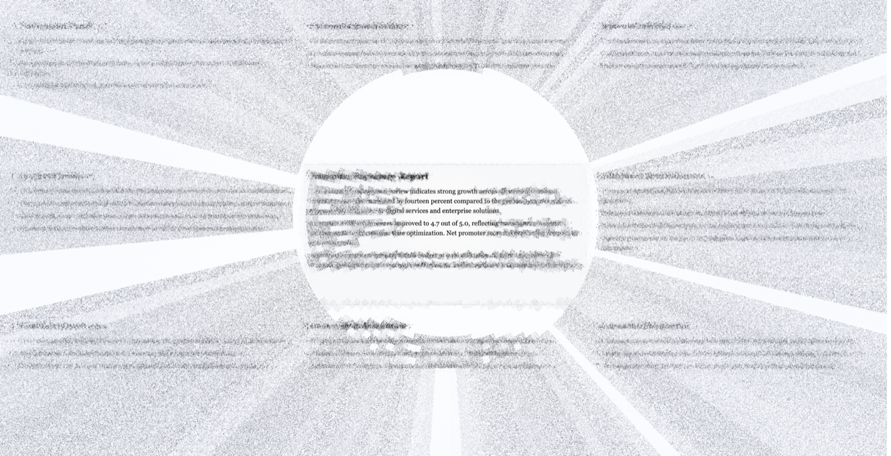

# ADR — L1 cortical-geometry: two tracks (RFV-safe displacement default + texture-cognition synthesis research)

- **Status:** Accepted — 2026-06-06
- **Context refs:** `docs/assessments/2026-06-05-post-isotropic-release-audit.md`, `docs/next-steps-2026-04.md` (the L1–L4 layered-gap model), `TODO.md` (Biological-plausibility roadmap)

## Context

Scrutinizer's peripheral model has two mechanisms that had been conflated under one "cortical" banner:

- **Displacement (mode 12, FOVI):** cortical-magnification geometry (CMF-derived sector extents, `w = log(r + a)`) drives an eccentricity-graded acuity-loss *displacement*. Sector geometry sets the transition rate — it is **not** statistical pooling. A bottom-up acuity model. RFV-safe (invents no content).
- **Statistical synthesis (mode 15, TTM cortical pooling):** summary-statistic texture synthesis over cortical sectors — the **top-down** model of peripheral perception (Rosenholtz mongrels, Freeman & Simoncelli 2011, Balas et al.). The cognitively faithful account of what the periphery *encodes* (crowding; "text-like stuff I can't read").

The 2026-06-05 audit rated bio-plausibility MIXED-leaning-regress because the bio-anchored model was not the default and the cortical-pooling path was silently broken. This session restored mode 12 as the default and validated it (foveal 82.4%), fixed the WebGPU storage-buffer gate (B2) so mode 15's sector pipeline runs again, and revived the peripheral-OCR readability gate.

With mode 15 runnable, we ran it through the gate + visual capture — the empirical L1 test (DPR-2, `ocr-test-page`):

| ring | mode 12 (displacement) | mode 15 (pooling) |
|---|---|---|
| fovea | 82.4% | **60.3%** |
| parafovea | 15.0% | **4.9%** |
| near | 1.1% | 2.4% |
| far | 0.8% | **3.2%** |

Mode 15 damaged the fovea, cliffed the parafovea, and read **more** in the far periphery than the near (far > near) — OCR latching onto **radial dithered-noise wedges** of synthesized texture (evidence below). Single-pass un-converged synthesis + hard sector boundaries.

## Decision

**Two tracks, two standards — keep both goals.**

1. **Real-time RFV-tool default = mode 12 (cortical-magnification-graded isotropic displacement).** RFV-safe by construction; validated by the OCR/psychophysics gate. The honest claim is "cortical-magnification-graded isotropic displacement" — cortical in *geometry*, not in statistical pooling. This is the tool's floor, not the project's ceiling.

2. **Texture-cognition synthesis (mode 15 direction) = active research track — NOT retired.** Simulating the top-down summary-statistic texture model is the *more* faithful account of peripheral perception and remains a project goal. The capture above is its measured baseline, with three diagnostic targets:
   - **Foveal bleed** (60% vs 82%) — pooling not respecting the foveal clear-zone; likely a bug (mode 12 respects it). Fix first.
   - **Parafoveal cliff** (4.9%) — sector-extent / transition tuning.
   - **Wedges + far > near** — L4 hard sector boundaries (→ partition-of-unity / Gaussian-weighted overlap, Freeman-Simoncelli) and L3 un-converged single-pass.

   **Plan:** amortized-during-fixation convergence (next-steps P3 — iterate synthesis across 5–10 stable-gaze frames). This both approaches Brown's iteration depth *and* matches the perceptual fact that peripheral texture settles during fixation. The existing velocity-gating / metamer-freeze machinery (`renderer/scrutinizer.js`: `_metamerSaccading`, "resynthesize after saccade landing") is the stable-fixation hook.

3. **The OCR gate (incl. RC-2.6) is the development instrument, not mode 15's executioner.** A converged, faithful mongrel produces summary-statistic *texture*, not readable glyphs — so it should **pass** RC-2.6 (far ≤ near). RC-2.6 fails the *current* synthesis precisely because it emits glyph-like phantom artifacts. The target for the synthesis track: pass RC-2.6 while holding foveal preservation.

## Consequences

- **Validation tracks separate cleanly.** The real-time default is judged by the readability/psychophysics gate. The Brown-metamer SSIM comparison — a *category error* for displacement (the old numbers measured the broken fallback) — becomes meaningful only for the synthesis track, ideally offline where 300× iteration is available.
- **No need to calibrate L2/L3/L4 for the real-time default** — those are pooling-statistics layers; the default is displacement. L2/L3/L4 work belongs to the synthesis track, gated by L1 progress.
- **mode 0 (High-Key Ghosting) also fails RC-2.6** (far > near, long-range scatter) — expected; it is a legacy mode, not the default.
- **Naming:** mode 12 default claim = "cortical-magnification-graded isotropic displacement"; mode 15 stays "TTM Cortical Pooling (Tier 3 — research)." Stop framing real-time statistical pooling as imminent *for the tool*.

## Evidence / reproduce

- `docs/adr/evidence/2026-06-06-mode15-phantom-wedges.png` — the radial synthesis wedges.
- Reproduce: `TEST_DPR=2 node scripts/validate-peripheral-ocr.js --mode 15 --capture` (compare `--mode 12`).
