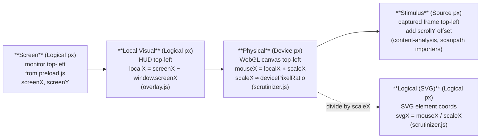
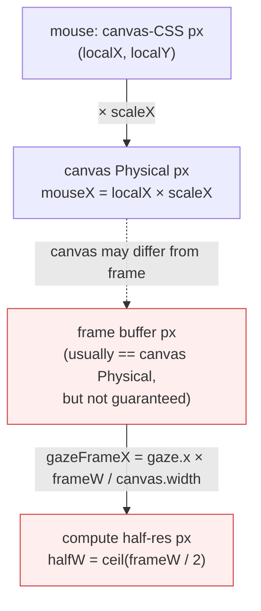

### 6. Coordinate Systems & DPI

Scrutinizer relies on precise alignment between **four top-level coordinate spaces**, plus a fanout of sub-spaces inside the WebGL/WebGPU rendering tier. Mismatches lead to "drift" or "offsets" on High-DPI (Retina) screens, or visual artifacts where the mask, compute, and shader disagree on where a pixel sits.

#### The Top-Level Pipeline



1. **Screen Coordinates (Absolute)**
   * **Source:** `preload.js` → `ipcRenderer.send('browser:mousemove', e.screenX, e.screenY)`
   * **Unit:** Logical pixels (DIPs)
   * **Origin:** Top-left of the physical monitor
   * **Why:** Bypasses browser zoom levels and internal layout shifts.

2. **Local Visual Coordinates (HUD)**
   * **Source:** `overlay.js` → `localX = screenX − window.screenX`
   * **Unit:** Logical pixels
   * **Origin:** Top-left of the HUD window (content area)
   * **Role:** Single source of truth for where the mouse is relative to the overlay.

3. **Physical Coordinates (WebGL)**
   * **Source:** `scrutinizer.js` → `targetMouseX = localX * scaleX`
   * **Unit:** Physical pixels
   * **Scaling:** `scaleX` is approximately `window.devicePixelRatio` (e.g., 2.0 on Retina)
   * **Why:** WebGL needs full resolution for crisp rendering (no aliasing).

4. **Logical Coordinates (SVG Overlay)**
   * **Source:** `scrutinizer.js` → `svgX = mouseX / scaleX`
   * **Unit:** Logical pixels
   * **Why:** SVG elements defined in HTML use CSS units (Logical).

#### The Golden Rule
**"WebGL is Physical, SVG is Logical."**
When passing coordinates from the WebGL loop (Physical) back to the DOM/SVG (Logical), you **MUST** divide by the current scale factor (`this.scaleX` or `dpr`). Failure to do so results in the overlay moving 2× faster than the mouse (drift).

---

### 7. Sub-Spaces Inside the Physical Tier

A subtler trap: even within the "Physical" tier, the renderer juggles **four distinct grids** that don't always have the same dimensions. CODEBASE_MAP gotcha #6 flagged this — drop the discipline and the mask, compute output, and shader fragment outputs disagree about where a pixel is.

| Sub-space | Dims (typical 1920×1080 viewport, DPR=2) | Set by | Read at |
|---|---|---|---|
| **Canvas CSS** | 1920 × 1052 (viewport minus toolbar chrome) | `<canvas>` style/`getBoundingClientRect` | DOM events, `event.offsetX/Y` |
| **Canvas Physical** | 3840 × 2104 (CSS × DPR) | `canvas.width/height` (set by Scrutinizer to match the captured frame buffer) | `gl.viewport`, WebGL shaders |
| **Frame buffer** | 3840 × 2104 (or whatever Electron captured at) | `hud:frame-captured` payload from main process | `_submitCongestionFrame`, `processFrame` |
| **Compute half-res** | 1920 × 1052 (`ceil(frame / 2)`) | `webgpu-crowding-compute.js` | Tier 2.5 stats/synth, Tier 2.75 pyramid |

**The two danger sites:**



1. **Canvas height ≠ Frame height** when the toolbar chrome eats vertical pixels. `renderer/scrutinizer.js:660-661` corrects for this explicitly:

   ```js
   const gazeFrameX = gaze.x * (frameW / this.canvas.width);
   const gazeFrameY = gaze.y * (frameH / this.canvas.height);
   ```

   **Rule:** Any code that maps gaze (canvas Physical) to frame coordinates must apply this `frameW / canvas.width` ratio. Skipping it produces a horizontal/vertical offset proportional to the toolbar height. The mask texture, congestion heatmap overlays, and any debug ring drawn in canvas Physical that needs to align with frame content must apply the same ratio.

2. **Frame → Compute half-res** is a straight `/2`, but `ceil()`-based: `halfW = Math.ceil(frameW / 2)`. For odd-width frames the last column has no fractional partner, which produces partial tiles in `crowding-stats.wgsl` (workgroup `8×8` reads beyond the half-res bound get zeros). Not a correctness bug, but the tile-count math at `webgpu-crowding-compute.js:` workgroup dispatch must match `ceil`, not `floor`.

3. **Scanpath replay → canvas** has dataset-specific conversions on top of the above. See `renderer/scanpath/coordinate-utils.js` for the four space conversions (`normalizedToPixels`, `stimulusToCanvas`, `degreesToPixels`, plus AdSERP page-space ↔ screen-space).

#### Diagnostic recipe

If something looks misaligned in production:

1. Confirm `event.offsetX === gaze.x / scaleX` (canvas-CSS ↔ canvas-Physical roundtrip).
2. Log `frameW` and `canvas.width` once per frame at the top of `processFrame()`. If they differ, the compensation at `:660-661` is what's keeping things aligned — anything that does its own mapping must apply the same ratio.
3. For compute artifacts, check whether `tileCountX = ceil(width / 8)` matches what `pyramid-stats.wgsl` actually iterates. Odd-width frames are where this drifts.
