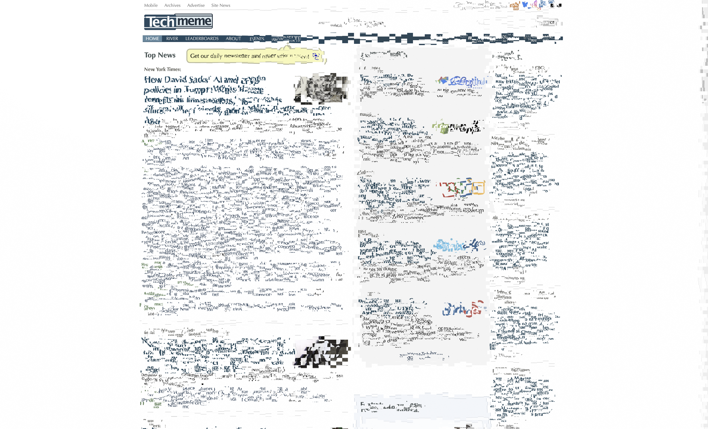
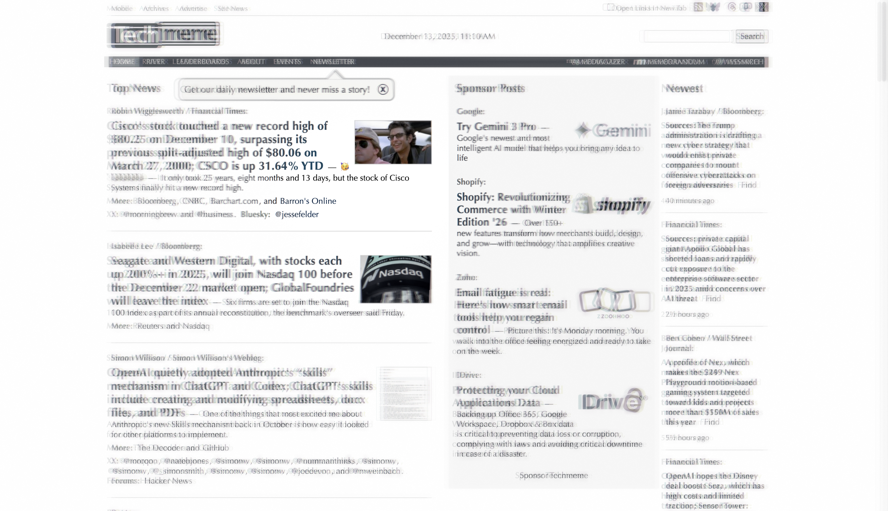
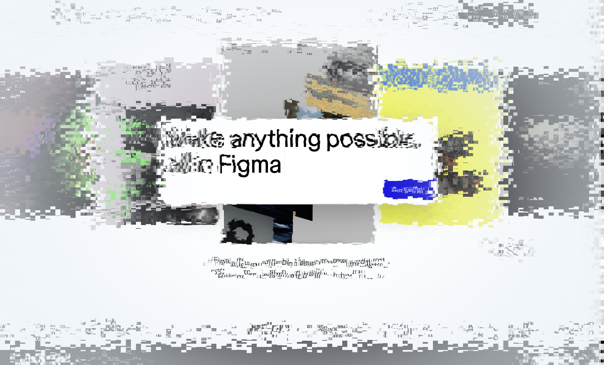
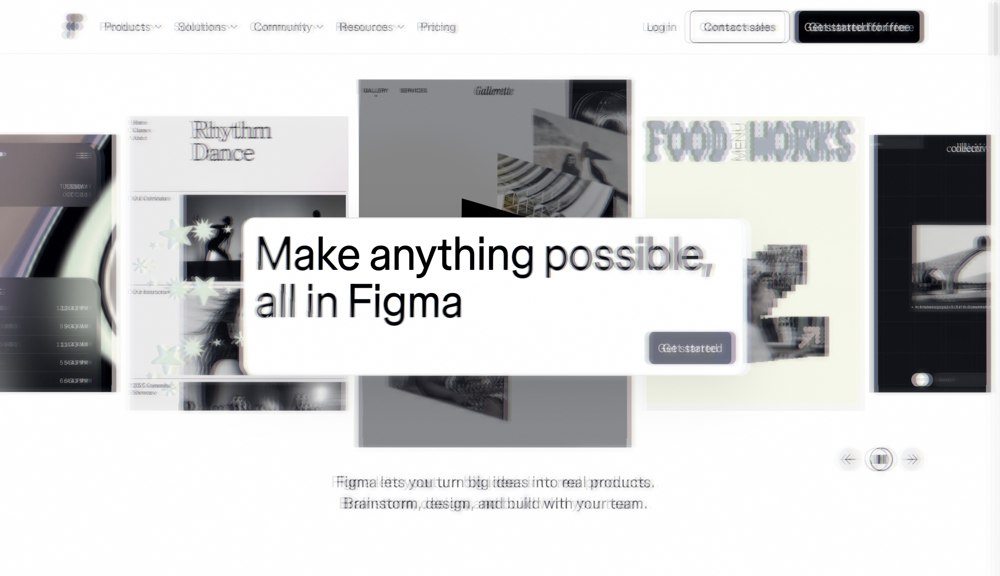

# Release Notes v1.4

**Release Date:** December 13, 2025

## TLDR
Simulation accuracy improved (Oklab, MIP pooling). UX polished (better visual overlays, clearer menu language). **Auto-updates** now notify you when new versions are available.


## Highlights

### 🔄 Auto-Updates
Scrutinizer now checks for updates on startup and notifies you when a new version is available.
- **Non-intrusive**: No automatic downloads — you choose when to update
- **GitHub Releases**: Opens your browser to download the latest DMG

### 🎨 Visual Overlay Refinement
The debug boundary system has been overhauled and renamed to **Visual Overlay**.
- **Renamed Options**: "Grid (Hi-Tech)" is now clearly labeled "**Fovea + Parafovea + Periphery**".
- **Linear Spacing**: The radial grid now uses evenly spaced rings to match linear acuity reduction, replacing the previous exponential spacing.
- **Variable Stroke Width**: Grid lines now become thinner as they move further from the fovea.


### 🌈 Oklab Saliency (Biological Accuracy)
The feature extraction engine for our Saliency Maps now uses the **Oklab** color space instead of RGB.
- **Why?**: Standard RGB is not perceptually uniform. Oklab separates Lightness (L) from Color (a, b) in a way that perfectly mimics the human eye's Magnocellular (Luminance) and Parvocellular (Color) pathways.
- **Benefit**: Saliency detection is now more stable and matches the "rod vision" simulation used in the main renderer.

📚 *Learn more: [Saliency Map & Fidelity Bias](foveated-vision-model.md#saliency-map--fidelity-bias)*

### 🚫 Inhibition of Return
A new Visual Memory mode that mimics the brain's tendency to de-prioritize recently visited locations.
- **New Mode**: Available under `Visual Memory > Inhibition of Return (10 fixations)`.
- **Function**: Recently fixated areas become **suppressed** (more distorted) rather than cleared, simulating a drop in saliency. This encourages the user to seek new information rather than re-fixating on old content.

### 🧠 MIP-Based Peripheral Pooling (Mongrel Tier 1)
Replaced the previous 5-tap Gaussian blur with **hardware MIP-map pooling**, which more accurately simulates how the peripheral visual system compresses information.
- **Biological Accuracy**: Based on Rosenholtz et al.'s pooling model—receptive field size doubles with eccentricity, which maps naturally to MIP levels.
- **Performance**: ~5x faster than previous blur (hardware-accelerated `textureLod()` vs. 5 texture samples).
- **Smooth Transitions**: A 10% blend zone at the fovea edge eliminates visible boundaries.
- **Intensity Modulation**: The "Peripheral Intensity" slider now correctly modulates pooling strength—low intensity = less aggressive pooling.

**Technical Details:**
```glsl
// MIP level grows with eccentricity
float mipLevel = clamp(normalizedEcc * 2.5, 0.0, 4.0);
vec4 pooled = textureLod(u_texture, uv, mipLevel);
```

📚 *Learn more:*
- *[MIP-Based Pooling (v1.4)](foveated-vision-model.md#mip-based-pooling-v14) — Technical implementation details*
- *[Rosenholtz et al. — Mongrel Theory](scientific_literature_review.md#vision-science--cognitive-psychology) — Scientific foundation*
- *[Mongrel Textures Spec](specs/implemented/mongrel_textures.md) — Tiered implementation strategy*

**Visual Evolution: v1.3 → v1.4**

The following comparisons show the improvement in peripheral rendering:

#### Real-World Content (Techmeme.com)

| v1.3: Gaussian Blur | v1.4: MIP Pooling |
|:---:|:---:|
| Washed out colors | Vibrant, biologically accurate |
|  |  |

#### Design Tool Interface (Figma.com)

| v1.2: Blocky Pixelation | v1.4: MIP Pooling |
|:---:|:---:|
| Harsh rectangular artifacts | Smooth pooling, smaller file (5.5MB vs 7.2MB) |
|  |  |


### 💅 UI Polish
- **Less Distracting URL Bar**: The toolbar URL input is now dimmer and semi-transparent by default, reducing visual competition with the canvas. It automatically brightens on hover or focus.
- ~~**Menu Terminology**: "Mongrel Mode" renamed to "Effect Type". Removed in v2.2 — mongrelMode is now set per-mode via modes.json.~~
- **Visual Fidelity (v1.4.1)**:
  - **Coupled Warp + MIP Pooling (Tier 1.5)**: Physically simulates peripheral crowding by scaling position jitter with the integration field size.
  - **Unbound Color (Tier 1.6)**: Simulates Parvocellular resolution loss by blurring chromatic fringes ("watercolor bleed") and ensuring radial offset direction.

## Developer Notes
- **Custom Overlays Guide**: Added a new section to `docs/developers_guide.md` explaining how to implement high-performance custom overlays using the new Group Translation pattern.
- **MIP Pooling Documentation**: See [MIP-Based Pooling (v1.4)](foveated-vision-model.md#mip-based-pooling-v14) for implementation details.
- **Golden Image Process**: Updated [Golden Methodology](developers_guide.md#golden-methodology-regression-prevention) with per-release tagging requirements.

## In Consideration: Linguistic Pre-Attentive Layer 🔮

We've completed the v2 specification for **Semantic Guidance & Linguistic Priming** — a major upgrade to how Scrutinizer models goal-directed attention.

> [!TIP]
> **The Core Idea:** Instead of just simulating *where* you look (bottom-up saliency), we simulate *what* you're looking *for* (top-down attention). By running sentence embeddings via **Transformers.js + ONNX Runtime**, the engine computes semantic similarity between user goals and page content in real-time.

**Key Innovations in v2 Spec:**
- **Integrated Embedding Computation**: all-MiniLM-L6-v2 runs in-browser via WebGPU/WASM
- **Legibility Gating**: Semantic signals suppressed in areas where font size × eccentricity makes text unreadable
- **Dynamic Exploration/Exploitation**: Weighting automatically shifts based on detected "information scent"
- **Icon Dictionary**: Maps `fa-shopping-cart`, `material-icons-*` to semantic keywords (no more "icon blindness")
- **Distractor Analysis**: Identifies high-V, low-S elements competing for attention

📚 *Read the full spec: [Linguistic Pre-Attentive Layer v2](Linguistic%20Pre-Attentive%20Layer.md)*

---

## Further Reading
- [Foveated Vision Model](foveated-vision-model.md) — Complete technical documentation of spatial zones, strength curves, and pipeline stages
- [Scientific Literature Review](scientific_literature_review.md) — Academic foundations including Rosenholtz's Mongrel Theory
- [Mongrel Textures Spec](specs/implemented/mongrel_textures.md) — Roadmap for Tier 2 (contrast-preserving) and Tier 3 (WebGPU) pooling
